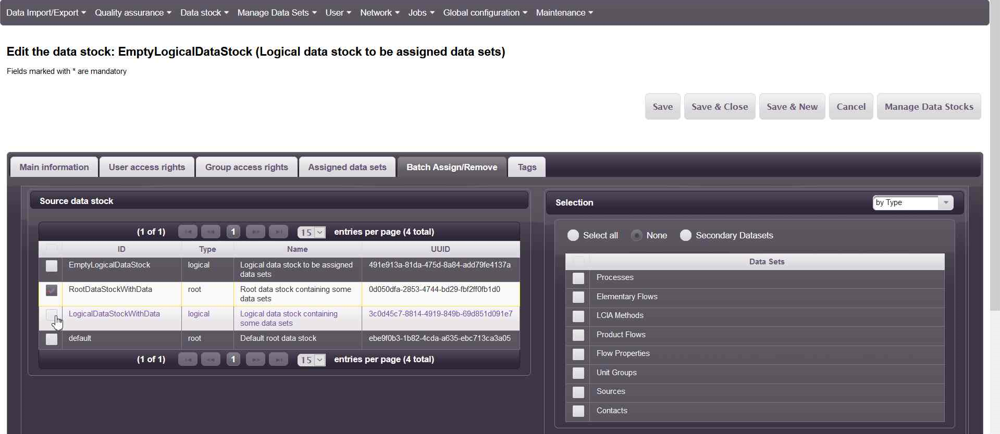
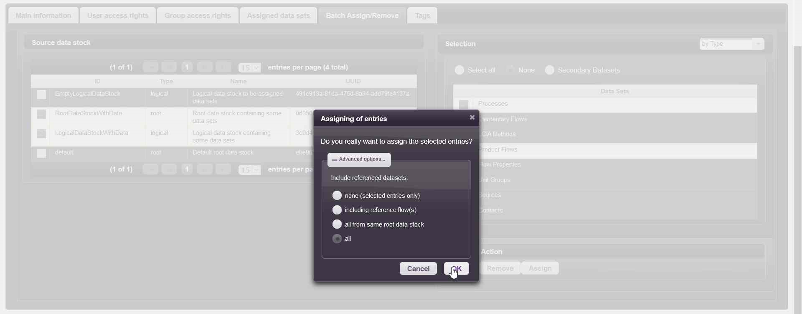
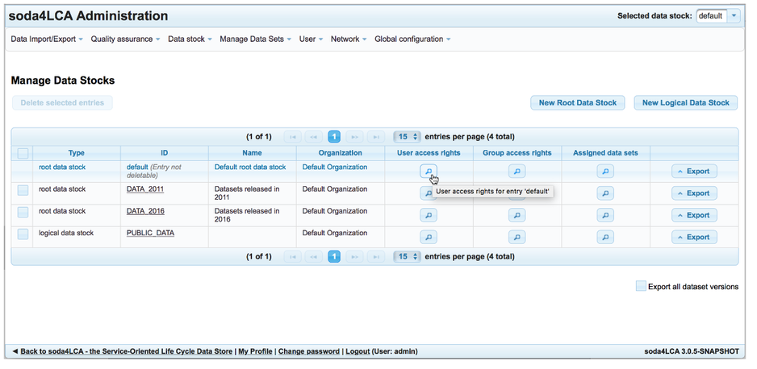

# soda4LCA Administration Guide

General Information
===================

Before performing any administrative tasks on a database node, you have
to be authenticated with administrative permissions. The application
ships with a default administrative account, `admin`. The default
password for this account is `default`.

> **Important**
>
> Make sure you change the default password immediately after setting up
> the node.

Logging in as administrator
---------------------------

To log in to the application, click on "Login" on the lower left hand
side of the page. The login dialog appears:

Enter valid credentials and confirm by clicking "Login".

Upon successful login, the administrative menu bar will appear in the
top section of the page.

Changing the default password
-----------------------------

Once logged in, click on "My Profile" in the lower left hand corner of
the page. Then enter the new password in the "Password" and "Repeat
Password" fields.

Confirm by selecting the button "Change user information".

A confirmation message will be shown indicating that the password has
been changed.

Managing Access
===============

User and Group Management
-------------------------

For managing access to the various features of the application as well
via the web user interface as well as the application service interface,
a role-based approach has been implemented.

By default, an anonymous user (one that is not authenticated) can
browse, search and read all datasets that are public. For all other
operations, special permissions are necessary. The following table lists
all available permissions (roles):

| Role                  |   Description									|
|------------ | -------------------------------------------------------- |
| *Metadata read*       |   This role grants permission to read the metadata of process datasets.|
|*Full read and export*|   This role grants permission to read/display all sections of a process dataset as well as export (download) it as XML.|
|*Checkout for editing*|   This role grants permission to check out a dataset for editing. The dataset will be locked for edit operations until checked in again.|
|*Checkin of data sets*|   This role grants permission to check in a dataset after editing.|
|*Release management*  |   This role grants permission to modify the *released* / *unreleased* status of a dataset.|
|*Delete data sets*    |   This role grants permission to delete datasets from the database.|
|*Manage user*         |   This role grants permission to add, edit and remove users and groups.|
|*Admin rights*        |   This role grants permission to access the administrative functions via the web interface.|
[Access rights (roles)]

These roles can be assigned to groups. For instance, an imaginary group
TOOLS may be assigned the roles *Checkout for editing* and *Checkin of
data sets*. Furthermore, a user can be assigned to a group. For example,
the user "tool1" could be assigned to the group TOOLS, hence this user
account may connect to the database and perform dataset checkin and
checkout operations.

### Managing users

The "User" menu offers the options to add and manage users or groups.

#### Adding a user

To add a user, select "Add user" from the User menu. The "Create User"
page will appear.

Fields marked with an asterisk (\*) are required. When finished with
entering the data, select the button "Create user":

#### Editing a user

To edit a user profile, select "Manage users" from the "User" menu. A
page with the list of all users will appear. You can edit a user profile
by clicking its name, or delete users by selecting one or multiple
entries using the checkbox in the left column and then selecting the
"Delete" button.

### Managing groups

#### Adding a group

To add a group, select "Add group" from the User menu. The "Create
Group" page will appear. You can select the roles that you want to be
associated with this group, as well as the users you want to belong to
this group. This can be changed at a later time as well.

#### Editing a group

To edit a group, select "Manage groups" from the "User" menu. A page
with the list of all groups will appear, with the list of roles
associated with each group showing in the "Roles associated" column. You
can edit a group by clicking its name, or delete groups by selecting one
or multiple entries using the checkbox in the left column and then
selecting the "Delete" button.

Managing Datasets
=================

UUID
-------
###General
The automatically generated UUID (Universally Unique Identifier) is the unique id of a data set (different versions of a dataset have same UUID). Together with the version of a data set, it does uniquely identify each data set. 

####Show UUID of a Data Set
There are several ways to show the UUID of a data set. The easiest way is to hover over the name of the data set. 
Then the UUID of the data set is shown followed by the version of the data set.

Another easy way is to look at the "Name" column of a data set. In this column, the UUID is printed below the name of the corresponding data set.

####Filter By UUID
To search for a certain UUID, one has to type in the string "uuid:" followed by a 
substring of the wanted uuid in the filter text field of the name column.
Then all data sets containing the written substring are shown.

Here is an example how you can filter by a certain UUID:

Filter By Import Date
---------------------
The Import timestamp views the date and time of the import. If one wants to search for datasets imported at a certain date, one has the option to use the filter bar in the Import timestamp column to filter by the wanted import date.
There are several ways to filter by the import date:
- by import year: type in the wanted import year
- by import month and year: the month followed by period and year
- by import day, month and year: &lt;day&gt;.&lt;month as number&gt;.&lt;year&gt;

Examples for filtering by a date:

 
One can also filter by a certain time span by typing the keyword "from" or "until" followed by the wanted import date if one wants to look for all datasets imported from or until a given date. It is also possible to use a combination of these two keywords to filter by a restricted time span. Therefore one has to type in the keyword "from" followed by the first wanted import date and the the keyword "until" followed by the last wanted import date.

Examples for filtering by a timespan:

Data Import
-----------

To import datasets into your soda4LCA node, select "Import" from the
"Data Import/Export" menu:

Then select "Browse":

Now an operating system file dialog will appear, allowing you to select
the desired file(s):

You may select one or several of the following file types:

-   XML documents containing ILCD datasets

-   ILCD ZIP archives containing ILCD datasets

When you are finished selecting files and confirm the file system
dialog, a list of selected files will appear on the page. Click "Upload"
to upload them to the server.

Once the upload is finished, a corresponding message will appear:

Now select the "Continue to step 2" button. A list of all uploaded files
will appear.

Select "Import files". As the import progresses, messages will be
written to the status log console.

> **Important**
>
> During the import, do not reload the page.

When the message "Import of files finished" appears, the import is
complete.

Review the status log for error messages. When a dataset of the same
UUID and version already exists in the database, this dataset will not
be imported and a message is written to the status log.

Data Export
-----------

The entire database can be exported to a ZIP file that can be stored
locally on the client. That file can later be imported to an empty
database.

To export the database, select "Export Database" from the "Data
Import/Export" Menu.

Then click the link "Export entire database to ZIP file".

Your browser will prompt you with a download dialog and download the ZIP
file.

Versioning
----------

Each dataset carries a unique UUID (Universally Unique Identifier) as
well as a version number that is to be incremented when the dataset is
updated.

In general, always only the latest version of a dataset (i.e. the
dataset with the highest version number) is shown. Previous versions can
be accessed by navigating to the most recent version and then selecting
the desired version from the "Other versions" section on the dataset
overview page:

Deleting datasets from the database
-----------------------------------

To delete one or more datasets, select the appropriate entry from the
"Manage Datasets" menu:

Then navigate to the dataset(s) that you intend to delete. Each dataset
version will be displayed as a separate entry.

For every dataset to be deleted on a page, select the checkbox in the
first column. Then select the "Delete" button:

{width="400"}

A confirmation dialog will appear.

Upon confirmation, the datasets will be deleted from the database and
for each deleted dataset, and information message is shown.

Organizing Data
===============

Logical And Root Data Stocks
----------------------------
Data sets in a node can be organized in several data stocks for e.g. 
separating private and public data sets.

Each data set belongs to exactly one root data stock. If e.g a root data stock includes one data set, 
then one cannot import the exact same data set into another root data stock.
Each node has a default root data stock which cannot be deleted.

A logical data stock can also contain an arbitrary number of data sets but does not have to 
contain each data set of a data stock. The main difference here is that a data set can belong 
to an arbitrary number of logical data stocks.

Creating A New Root Data Stock
------------------------------
To create a new root data stock, select "New Root Data Stock" in the Data Stock menu.

In the main information view, select the desired data stock type and organization and define 
an ID of the new data stock and, if wanted, also enter a name and a description of the data stock.
>Please note that only letters, numbers and underscores are allowed to define a data stock ID.

Then save the new created data stock by selecting either "Save" to go to the main information view 
of the newly created root data stock, "Save & Close" to return to the Manage Data Stock view or 
"Save & New" to create another data stock.

Creating A New Logical Data Stock
---------------------------------
To create a new logical data stock, select "New Logical Data Stock" in the Data Stock menu.

The form for creating a new logical data stock is the same as the form for creating a new root data stock 
(except that selected type is now "logical data stock" instead of "root data stock"), so you can follow the 
instructions for creating a new root data stock.

Assign Data to A Logical Data Stock
-----------------------------------
### Manually
To assign data sets from a root data stock to a logical data stock, go to the 
Manage Data Stock view by selecting Manage Data Stocks on the admin home 
page or by selecting the respective entry in the Data Stock menu.

In the Manage Data Stock view, go to the assigned data sets view by either 
selecting the button "Assigned data sets" of the desired data stock select a 
logical data stock or by selecting the ID of the corresponding data stock and 
selecting the "Assigned data sets" tab.

Then select the "Assign..." button in the top right corner of the view, select 
the desired data sets and click on "Assign". To show only data sets of a
 certain data stock, you can select the desired data stock by selecting the 
 data set from the "select data stock" drop-down menu.
 

 

### By data set type
You can assign/remove *all data sets of one or more given types* from *one ore more data stocks*
to a logical data stock, e.g. all processes and product flows from other data stocks.
(Including or not including referenced data sets.)

To do so, go to the Manage Data Stock view by selecting Manage Data Stocks on the admin home 
page or by selecting the respective entry in the Data Stock menu.

##  
##  
Then select the data stock to/from which you want to assign/remove data sets and go to the details view,
e.g. via

##  
##   
and select the tab *'Batch Assign/Remove'*.

##  
##  
Specify the data sets by first selecting the stocks in which they can be found
and then by specifying the relevant types.

##  
##  
Now you can simply click on *'Assign'* or *'Remove'* and decide how you want to deal with referenced
data sets.

By clicking on the *'Ok'* button you launch a job which will handle the assigning/removing in the background.
To check the status you can simply navigate to the *'Job queue'*, either by the *'Jobs..'* button that just appeared in the 
*'Choose Action'* panel or by selecting the respective entry in the regular '*Jobs'* menu.

### By importing references
If you have an Microsoft Excel file (.xls or .xlsx) that references specific data sets, you can assign/remove
all (available) referenced data sets to/from a logical data stock.
(Including or not including implicitly referenced data sets.)

>**Important**
>Your Excel file must at least contain columns for *'Data set type'*, *'UUID'* and *'Version'*. They should be the first three columns of your Excel file and they must be properly formatted, that is   
> - *Data set type*: Formatted according to the ILCD standard and the export standard of soda4LCA, that is 'process data set', 'flow data set', 'LCIA method data set', 'flow property data set', 'unit group data set', 'source data set', 'contact data set'. *Be sure to match the case*.   
> - *Version*: String type of the form nn.nn.nnn

To do so, go to the Manage Data Stock view by selecting Manage Data Stocks on the admin home 
page or by selecting the respective entry in the Data Stock menu.

##  
##  
Then select the data stock to/from which you want to assign/remove data sets and go to the details view,
e.g. via

##  
##  
and select the tab *'Batch Assign/Remove'*.

##  
##  
Now select the *'Selection by Excel-Import'* option in the header of the *'Selection'* panel
and click on the *'Browse'* button to find your Excel file.

##  
##  
The next step is to upload the file after which you can see the number
of successfully imported references and the name of the file at the bottom
of the panel. (This may take a few seconds.)
> Note that you can only upload and handle one file at a time.

##  
##  
Now you can simply click on *'Assign'* or *'Remove'* and decide how you want to deal with
implicitly referenced data sets.

By clicking on the *'Ok'* button you launch a job which will handle the assigning/removing in the background.
To check the status you can simply navigate to the *'Job queue'*, either by the *'Jobs..'* button that just appeared in the 
*'Choose Action'* panel or by selecting the respective entry in the regular '*Jobs'* menu.

Permissions
-----------
To set permissions of certain data stocks, go to the "Manage Data Stocks view" and 
select the "User access rights" button of the desired data stock.

In the User access rights view, you can then set the following access rights for an unauthenticated user:

|Permission    |Description                                                                     |
|--------------|--------------------------------------------------------------------------------|
|read          |Data set can be read and meta data can be seen (excluding input/output section) |
|write         |Reserved for later use                                                          |
|import        |Data sets can be imported                                                       |
|export        |Data sets can be exported, including input/output section                       |
|checkin       |Reserved for later use                                                          |
|checkout      |Reserved for later use                                                          |
|release       |Reserved for later use                                                          |
|create        |Data sets can be created                                                        |
|delete        |Data sets can be deleted                                                        |

To set public permissions of only certain data sets of (several) data stocks, remove permissions for 
unauthenticated users of root data stocks that shall contain private data sets.

Then create a new logical data stock and assign all data sets which shall be publicly visible to the 
logical data stock. Then adjust the permissions for unauthenticated users of the logical data stock. 

>Please note: A permission of a data set is not given for an unauthenticated user unless the 
permission of any data stock containing the corresponding data set is set.

To assign user(s) to a data stock, select in the "User Access Rights" view the "assign..." button. 

This opens a window containing the Assigning users view. In the left list, there are users shown that have no permission to the given data stock. Then select one user and click on the button showing an arrow pointing to the right. 

Now the desired user should appear in the right list. (This step can be repeated until all desired users that shall have permissions to given data stock are viewed in the right list.) 

If you want to grant all existing users permission to given data stock, you simply can select the second button listed from top to bottom.

To finish the step, select the "assign users" button. 

Now the user should be listed in the User Access rights view and one can grant now the new assigned users certain permissions as described above.

Tags
----

Arbitrary tags can be defined assigned to data stocks.

To create or edit existing tags, select "Tags" from the "Global configuration" 
menu. In the tags view, new Tags can be added either with the "Add" Button on 
the top left or by right clicking on a row with an existing tag. Clicking on 
either "Add" button adds an empty row at the end of the table. Right clicking
on a row with an existing tag also allows you to delete the selected tag by 
clicking on the "Delete" button afterwards. Tags can be edited by left 
clicking the tag name or the tag description. Changes to the tag table have to
be confirmed by clicking the "Save" button on the top right. The "Cancel" 
button next to the "Save" button discards all changes made.

To assign one or more tags to a data stock, go to the "Manage Data Stocks view",
edit the desired data stock and select the "Tags" tab. A list with all existing
tags will appear where you can add and remove tags from a data stock. Tags which
are assigned to a data stock will appear on every process dataset contained in 
the data stock.

Assigned tags will be shown in a dedicated column in the "Manage Processes" view
and at the top of the process dataset detail view.

Moving datasets between root data stocks
----------------------------------------

In certain situations it may be necessary to move datasets from one root data 
stock to another one. 

WARNING: This operation may seriously affect the consistency of your data and
must be used with great care. Use it only if you know exactly what you are 
doing. You have been warned.

In the "Manage Processes/Flows/etc." view, select the datasets to be moved and
press the key combination "Ctrl-Shift-M" on your keyboard. A warning dialog 
will appear and then a dialog that will allow for selecting the target data 
stock.

Managing dependencies
---------------------

As typically a process dataset contains a number of references to other 
datasets such as flow, source and contact datasets, these may need to be 
considered when for example assigning a dataset to a logical data stock. In
this case, not only the process needs to be assigned, but also all secondary
datasets that are referenced by the process (which are referred to as
dependencies).

From version 4.0, in the confirmation dialog of assign/remove/delete/move 
operations, a range of options is presented to automatically extend the 
current operation to a defined set of dependencies.

These are in detail:

- none: Only the selected entries will be considered.

- reference flow(s): All flow datasets that are referenced from the selected
processes and marked as reference flows will be considered in addition to the
processes. 

- all from same data stock: All referenced datasets that are contained in the
same data stock as the selected items will be considered.

- all: All dependencies will be considered, regardless of the root data stock
they are stored in. Take care when using this option.       

>Take care when using these options for removing or even deleting datasets. This
>may affect secondary datasets that are referenced by other processes.

A good practice is to include all dependencies from the same data stock when
assigning, and include only the reference flow(s) when removing from a data
stock (provided the reference flow(s) are not used by other processes). 

Managing Networking
===================

Displaying information about the local node
-------------------------------------------

To review the information exposed by the local node to other nodes on
the network, select "About this node" from the "Network" menu:

The node and administrator information is shown. Refer to the
Installation Guide for information on how to edit this information.

Adding nodes
------------

To add a node to the list of foreign nodes known to the local node,
select "Add Node" from the "Network" menu. On the following page, you
can enter the following:

-   a service URL (required)

-   a username/password combination (optional).

Enter the service URL of the node you want to add and select the "Add
node" button:

The application will attempt to connect to the foreign node and retrieve
its metadata. If this was successful, the node is added to the list of
foreign nodes, and a confirmation message will appear:

If the connection fails (due to the foreign node being unreachable, the
entering service URL being incorrect etc.), the list of nodes will not
be altered and the "Add node" page will still be shown.

Managing nodes
--------------

To see the list of foreign nodes, select "Manage Nodes" from the
"Network" menu.

To see the details about a node, click on its name. The details/update
page will appear.

If necessary, you may change the information and confirm by clicking
"Update node information".
Registering with a registry
===========================

Note: The functionality described in this chapter is not yet available
in the 1.2.0 release.

Adding a new registry
---------------------

In order to utilize the advanced network capabilities of the
application, the node needs to be registered with an existing registry.
Before the registration process can start, the registry has to be added
to the application's list of known registries. Only users with
administrator privileges are allowed to perform this operation. In order
to add a new registry:

1.  Navigate to Network -&gt; Registries

2.  Press the "Add registry" button:

  

3.  The following form will be displayed:

   

4.  Fill in all mandatory fields and press "Save"

All values that have to be inserted will be published. It is important
to insert the exact values, especially UUID and Base URL. In case the
network doesn’t work as expected, please check the value of UUID.

Showing registry details
------------------------

Users with appropriate privileges have to possibility to inspect the
details of a registry.

1.  Select "Registries" from the "Network" menu

   

2.  Click on the appropriate registry name and consult the
    registry details.
    
 

3.  When a node is the part of the network, registry details and a list
    of nodes in the network will be displayed. Otherwise, only the
    registry details will be shown.
    
 

Editing registry details
------------------------

Users with appropriate privileges have to possibility to edit details of
a registry.

1.  Navigate to "Network" -&gt; "Registries"

2.  Click "Edit registry" in the "Action" column of the selected
    registry
    
 

3.  You will be redirected to the "Registry details" page.

 

4.  Insert new values and press "Save".

Removing a registry
-------------------

Users with appropriate privileges have the possibility to remove a
registry from the list of registries known to the node. Registries on
which the node is already registered cannot be removed, the node has to
be deregistered first.

1.  Navigate to Network -&gt; Registries

2.  Click the "Edit registry" link in the "Action" column of the
    selected registry.

 

3.  The system will ask for confirmation.

 

4.  Confirm the choice.

5.  A confirmation message will be displayed.

 

Node registration
-----------------

To send a node registration request to a registry, execute the following
steps:

1.  Navigate to Network -&gt; Registries

 

2.  Select "Registry" and in the "Action" column click on "Register" –
    the registration page will appear.

 

3.  Complete the "Access Account" and "Access Password" fields. Note:
    these fields are not your credentials for the node application!
    These fields will be used to authenticate the deregistration action,
    so keep this information for later. Node ID and Base URL are entered
    by default by the system, but it is possible to change the values.
    Please be careful with the URL – in case of an incorrect value, the
    registration will be not processed.

 

4.  After successfully sending the node registration request, the status
    of this node on the registry is "Pending registration".

 

5.  When the registry administrator approves your request, the status
    will be changed to "Registered". You will be also informed about the
    approval by email.

 

   Note: A node can be registered in multiple networks.
   

Node deregistration
-------------------

In order to deregister a node from a registry, follow these steps:

1.  Navigate to Network -&gt; Registries

2.  Find the registry you want to deregister from and click the
    "Deregister" link in the "Action" column

 

3.  You will be redirected to the authorization page. Enter user and
    password which were selected during registration and click
    Deregister

 

4.  After pressing the button, you will be asked for confirmation. Click
    "Yes":

 

5.  The system will prevent you from deregistration if there are any
    registered datasets. You will be asked to deregister the
    datasets first.

 

   If the user name and/or password entered are incorrect, an
    appropriate message will be displayed.
 
