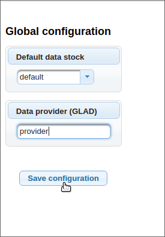
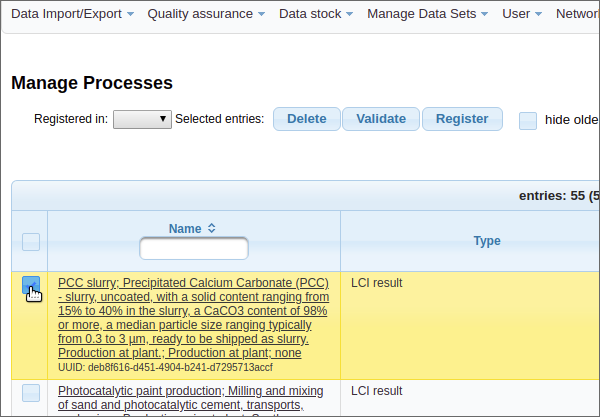
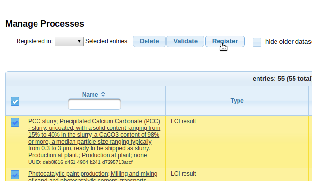

# soda4LCA GLAD Guide

Setting Up GLAD 
===================
To be able to use the GLAD framework, one has to enable the GLAD feature in the 
configuration file (file 'soda4LCA.properties').
To enable the GLAD feature, the following configuration should be set:
 
- Enabling the GLAD feature: `feature.glad = true`
 
- Setting the GLAD URL: `feature.glad.url = https://www.globallcadataaccess.org`
 
- Setting the API key for access to GLAD database: `feature.glad.apikey = esdaurt6w3wuw4264928eqihsHGDZSadueaoduf...`

 
 
 Change/Show Data Provider Name for GLAD
-----------------------------------------
To show the data provider name for GLAD, either select 'GlobalConfiguration'->'Configuration'
in the admin menu shown at the top of the page or click on the 'Configuration' 
button shown in the admin index page. Then the data provider name for 
GLAD is shown in the text field labeled 'Data Provider (GLAD)'.
   
::: {custom-style="Image"} 
{ width=6cm }
:::
   
::: {custom-style="Image"} 
{ width=5cm }
:::
   
In order to change this name, type in the wanted new name and save 
the changes by clicking on button labeled 'Save configuration'.
   
::: {custom-style="Image"}
{ width=5cm }
:::
   
Register a Data Set to GLAD
============================
1. Before a data set can be registered to GLAD, the GLAD feature has to be enabled 
   (if not done yet, look up Section 1 - 'Setting Up GLAD' for further instructions) 
   and one has to be authenticated (see Administration guide for further information). 
   To register a data set to GLAD, start from the admin index page and head to the 
   'Manage Processes' page (either by clicking on the given button in the index page 
   or by selecting 'Manage Datasets' -> 'Manage Processes' in the admin menu at top of page).

2. In the next step select by clicking on the selection box left of data set name 
   you want to register to GLAD and then click on the button 'Register'. You will be 
   directed to a page containing an overview of data sets you want to register.
   
   ::: {custom-style="Image"}
   { width=12cm }
   :::
   
   ::: {custom-style="Image"}
   { width=12cm }
   :::
   
   If you want to register all data sets from given page then click on the selection box 
   right above the first data set name as shown in image below. Then click on the button 
   'Register' to get to the next step.
   
   ::: {custom-style="Image"}
   { width=12cm }
   :::
   
   ::: {custom-style="Image"}
   { width=12cm }
   :::
   
3. At the bottom on the page, click at the drop-down menu to be able to see all registries 
   you can register to (GLAD should be included in this menu) and select 'GLAD'. 
   Then click on the button 'register'.
   
   ::: {custom-style="Image"}
   { width=14cm }
   :::
   
   ::: {custom-style="Image"}
   { width=14cm }
   :::
   
4. In the last step, you are directed to a summary. This page shows how many data sets were 
   successfully registered to GLAD and how many data sets were not registered. 
   
   ::: {custom-style="Image"}
   { width=6cm }
   :::
    
   Version with all data sets registered:
   
   ::: {custom-style="Image"}
   { width=6cm }
   :::
   
   If some data sets could 
   not be registered to GLAD then the given data sets and the reason why the data sets could 
   not be registered are shown in the table below. Possible reasons are:

   - The data set is rejected by GLAD
 
   - The data set is already registered to GLAD 
  
   - An error occurred while data set was registered
   
   ::: {custom-style="Image"}
   
   :::
   
   ::: {custom-style="Image"}
   { width=12cm }
   :::
  

Show All Data Sets Registered to GLAD
======================================
1. To show all data sets registered to GLAD, go to the 'Manage Processes' view. 
   At the top left at the page is a drop-down menu labeled 'Registered in:'. 
   
   ::: {custom-style="Image"}
   { width=7cm }
   :::
   
2. Click at the drop-down menu and select GLAD. Now all data sets which are registered 
   to GLAD from given data stock are shown in the table below.
   
   ::: {custom-style="Image"}
   { width=7cm }
   :::
   

Deregister a Data Set From GLAD
===============================
1. To deregister a data set from GLAD, go to the 'Manage Processes' view. 

2. Then change the view of processes by selecting 'GLAD' in the drop-down menu 
   labeled with 'registered in' (for further instructions see Section 3 - 
   'Show All Data Sets Registered to GLAD'). Now all data sets registered 
   to GLAD from given data stock are shown.
 
3. In the next step select the given data set(s) you want to deregister from 
   GLAD by selecting the check box left of the name of data set.
   
   ::: {custom-style="Image"}
   { width=12cm }
   :::
   
   Variant with all selected data sets
   
   ::: {custom-style="Image"}
   { width=11cm }
   :::
   
4. Lastly click on the button 'Deregister' to deregister selected data sets from GLAD.
   
   ::: {custom-style="Image"}
   { width=12cm }
   :::