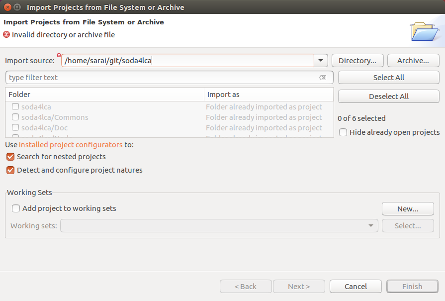

# soda4LCA Developer Guide #

## Setup Eclipse IDE for soda4LCA Development ##

### Prerequisites ###

This guide assumes you have the following software installed on your system:

- JDK 8
- Eclipse Java EE edition
- MySQL 5.0.x-5.7.x (needs to be running, a remote instance will also do) 
- Apache Tomcat 8.5 or 9.0

It also assumes you have already a local Git repository with a clone of the soda4LCA repo. If you do not have already, Eclipse's *Git Repositories* view allows you to easily clone a remote repo.


### MySQL Database ###

See the section "Database SQL mode and system variables" in the 
Installation Guide for the settings that need to be applied to the MySQL
configuration. 


### Importing Projects ###

1. Open the *Git Repositories* view (Window -> Show view -> Other... -> Git (folder) -> Git Repositories) and add your local soda4LCA Git repository (or clone the remote one).
 


2. Now right-click on *soda4lca [master]* in the *Git Repositories* view  and select *Import Projects...*.

3. All modules should be highlighted. Click *Finish*.



6. Now all modules are shown in the *Project Explorer* view.


### Setting up the Servlet Container ###

Open the *Servers* view and click to add a new server.
 


Choose *Tomcat v8.5 Server* from the list.


Add the `Node` module to the list of configured modules and finish the wizard.


Doubleclick on the newly created *Tomcat 8.5* entry in the *Servers* view and navigate to the *Modules* tab. 


Uncheck the *Auto reloading enabled* option.


Now go to the `Servers` folder in the *Project Explorer* view and edit the `server.xml` file.

Paste the following line into `GlobalNamingResources` section, replacing your database URL, username and password:

```
		<Resource auth="Container" driverClassName="com.mysql.cj.jdbc.Driver"
			logAbandoned="true" maxActive="8" maxIdle="4" name="jdbc/soda4LCAdbconnection"
			username="user" password="pass" removeAbandoned="true"
			removeAbandonedTimeout="300" testOnBorrow="true" type="javax.sql.DataSource"
			url="jdbc:mysql://localhost/soda_test?useUnicode=yes&amp;characterEncoding=UTF-8"
			validationQuery="SELECT 1" />
```

~~If you're using MySQL 5.7+ and haven't changed the `SQL_MODE` globally, use the
following connection string in the `url` attribute:~~ (No longer mandatory... The session variables has been already set in `PersistanceUtil.java`)

```
url="jdbc:mysql://localhost/soda4LCAdb?useUnicode=yes&amp;characterEncoding=UTF-8&amp;sessionVariables=sql_mode='ERROR_FOR_DIVISION_BY_ZERO,NO_AUTO_CREATE_USER,NO_ENGINE_SUBSTITUTION'"
``` 


In the *Servers* folder of your workspace, create a `soda4LCA.properties` file from the template in the `Doc` module. 


Now edit the `context.xml` file and adjust the location of your `soda4LCA.properties` file:

```
	<Environment name="soda4LCAProperties"
		value="/path/to/workspace/Servers/Tomcat v8.5 Server at localhost-config/soda4LCA.properties"
		type="java.lang.String" />
```


### Starting the Servlet Container ###

First download and extract the [MySQL Conncetor/J JAR (mysql-connector-java-x.x.x.jar)](https://dev.mysql.com/downloads/connector/j/) into the $TOMCAT_DIR/lib folder.  

Now you can use the *Start* button in the *Servers* view to start your local Tomcat instance.


### Misc. additional steps ###

***IMPORTANT:*** Make sure that in the Eclipse Preferences, you set the default text file encoding to `UTF-8` if not already default:


#### Editing resource bundles

Use the "Resource Bundle Editor" plugin to edit i18n properties files, it is available via the Eclipse Marketplace:

[https://marketplace.eclipse.org/content/resourcebundle-editor](https://marketplace.eclipse.org/content/resourcebundle-editor)


#### TestNG

Install the "TestNG for Eclipse" plugin via the Eclipse Marketplace: 

[https://marketplace.eclipse.org/content/testng-eclipse](https://marketplace.eclipse.org/content/testng-eclipse)

and set the following in Preferences under TestNG/Maven for the integration tests tu run properly from the IDE: 


#### Autocomplete

For autocomplete/content assist for JSF, refer to this posting:

[http://stackoverflow.com/questions/2136218/eclipse-autocomplete-content-assist-with-facelets-jsf-and-xhtml#7242705](http://stackoverflow.com/questions/2136218/eclipse-autocomplete-content-assist-with-facelets-jsf-and-xhtml#7242705)


#### Disable validation

To speed up the build process you can deactivate validation for each Module (Node, Commons, ...):
Right click, e.g., on the *Node* folder in the *Project Explorer* and select *Properties*. In the Builders context,
uncheck *Faceted Project Validation Builder* and *Validation*.


#### JPA Change Event Handler bug

To get rid of the *Change Event Handler (waiting)* bug, refer to this posting:

[https://stackoverflow.com/questions/19649847/eclipse-jpa-project-change-event-handler-waiting](https://stackoverflow.com/questions/19649847/eclipse-jpa-project-change-event-handler-waiting)


## Installing the soda4LCA Software ##

For running the soda4LCA on eclipse, you can mainly follow the 
[Installation Guide](/Doc/src/Installation_Guide/Installation_Guide.md). 
Yet the setup under Eclipse is slightly different.
In this section there are only the tasks mentioned that differ from the Installation Guide. 


### Basic Application Setup


1. Instead of adding the code to the `<GlobalNamingRessources>` section of the 
	`$CATALINA_HOME/conf/server.xml` file, add it to the `<GlobalNamingRessources>` 
	section of the the server.xml file in `Servers/Tomcat v8.5 Server at localhost-config` 
	of your soda4LCA project. Then adjust username and password and, if necessary, the Database URL accordingly. 

2. (optional) To avoid NotSerializableExceptions during Tomcat
    restarts, session persistence can optionally be disabled by
    uncommenting the line `<Manager pathname="" />` in the
    `context.xml` file.

3. Use the `soda4LCA.properties.template`  file you can find in the `Doc` folder
	of your project explorer as a template to create the application's configuration file and 
	place it into `Servers/Tomcat v8.5 Server at localhost-config` of your soda4lca project. 
	For detailed step-by-step instructions, refer to the section 
	[Configuring and customizing a node](Doc/src/Installation_Guide/Installation_Guide.md#configuring-and-customizing-a-node) 
	in the Installation Guide.


### Startup the application


After customizing the configuration file, start the servlet container under Eclipse 
by clicking on the run button in the Servers view.