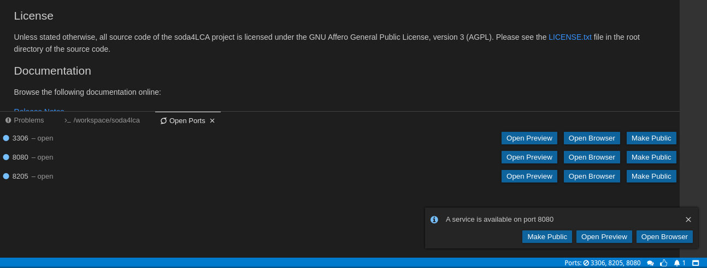

# Gitpod Guide

## Introduction

Gitpod is a fully automated way to prepare your development environment online with simple click of a button.

It comes pre-bundled with most of the tools you will need in order to contribute to the soda4LCA codebase.

## Create a workspace from a new git branch

Creating a new Gitpod workspace from an existing git branch can be done by just appending the link to you branch after `http://gitpod.io/#`. 

### Example: creating a workspace from default branch

If you want to create a workspace from the latest `5.x-branch` you simply type the following URL into your browser's address bar: `http://gitpod.io/#https://bitbucket.org/okusche/soda4lca/src/5.x-branch/`

### Example: creating a workspace from a feature branch

If you want to create a workspace from the latest `feature/schnitzelFlavoredKisses` you grab the hash of the latest commit on that feature branch instead.

`http://gitpod.io/#https://bitbucket.org/okusche/soda4lca/src/b30a79957211d379f67f64176002ccc03ee428a0/?at=feature%2FschnitzelFlavoredKisses`

## Setup your own Database
*feel free to skip this step, the workspace now comes bundled with MySQL 5.7.*

~~At the time being, Gitpod workspaces doesn't support MySQL 5.7 so you need to provide a remote instance with a running empty database.~~ and using SSH Tunneling, connect to said remote instance with SSH from inside the Gitpod workspace and perform a local port forwarding on port 3306.


The easiest and most straight forward way to setup MySQL 5.7 is using docker. After installing docker on your remote instance:

```bash
remote_instance@AWS ~ $ docker run -p 127.0.0.1:3306:3306 --name mysql57 -e MYSQL_HOST=127.0.0.1 -e MYSQL_DATABASE=root -e MYSQL_ROOT_PASSWORD=root mysql:5.7.22
```

this will create a database with the default user `root`, password `root` and default database `root`, these are the default hard coded values inside Node's POM plugin properties.

Next step is to connect to your remote instance from inside the Gitpod workspace in a separate terminal using `Menu bar -> Terminal -> New Terminal` or the shortcut `CTRL + SHIFT + [tilde]` and running the following command:

```bash
gitpod /workspace/soda4LCA $ ssh -i [yourkey.private] -L 3306:127.0.0.1:3306 [user]@[remote server IP]
```

## Use bundled MySQL database
You can entirely skip the previous step and use the database that comes bundled with the workspace.

Default credentials are:

* Username: root
* Password: root
* Default Database: root
* Auxiliary Database: root2
* Preconfigured datasource URL : `jdbc:mysql://127.0.0.1:3306/root?characterEncoding=UTF-8`


## Building Required Dependencies

The building process for the Node project is as easy as running a few simple commands,

You need to install every dependency required (including `Registry-api`, `Commons`, ...), which might take a while for the first time by running:

```bash
gitpod /workspace/soda4LCA $ mvn clean install -DskipTests -DskipITs
```

The same command automatically runs on the first time you access your fresh workspace, no need to run it a second time unless you have modified some dependencies in any pom.xml file.

## Building Node Project


The following command builds the Node project assuming you already have the needed dependencies and ran the previous command at least once on the beginning of you coding session.

```bash
gitpod /workspace/soda4LCA $ mvn -pl Node package -DskipTests -DskipITs -am
```

*Feel free to ignore any error related to failure of jcabi in the verify process:*

```
[ERROR] Failed to execute goal com.github.mike10004:jcabi-mysql-maven-plugin:1.0r3:start (mysql-test) on project Node: Execution mysql-test of goal com.github.mike10004:jcabi-mysql-maven-plugin:1.0r3:start failed: Non-zero exit code 1: stdout = ....
```

## Running a Node

The soda4LCA project comes with an embedded tomcat container which you can use to run the Node project on port 8080

```bash
gitpod /workspace/soda4LCA $ mvn -pl Node cargo:run
```

After the tomcat finished booting, you can connect to you Node instance from your browser by clicking on `Open Browser` button.



This button will open a new tab to the root path of the tomcat container which displays a 404 Not Found message.

The Node project by default is deployed under the `/Node` path. **so all you have to do is to append `/Node` at the end of the URL**

```bash
https://[PORT NUMBER]-[RANDOMIZED UUID].ws-eu01.gitpod.io/Node
```


Now you are ready to go.
