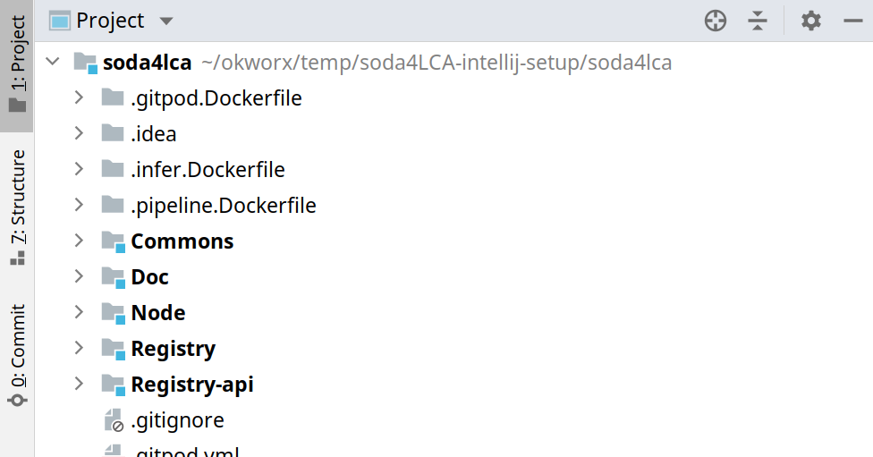
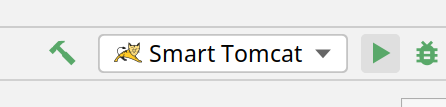
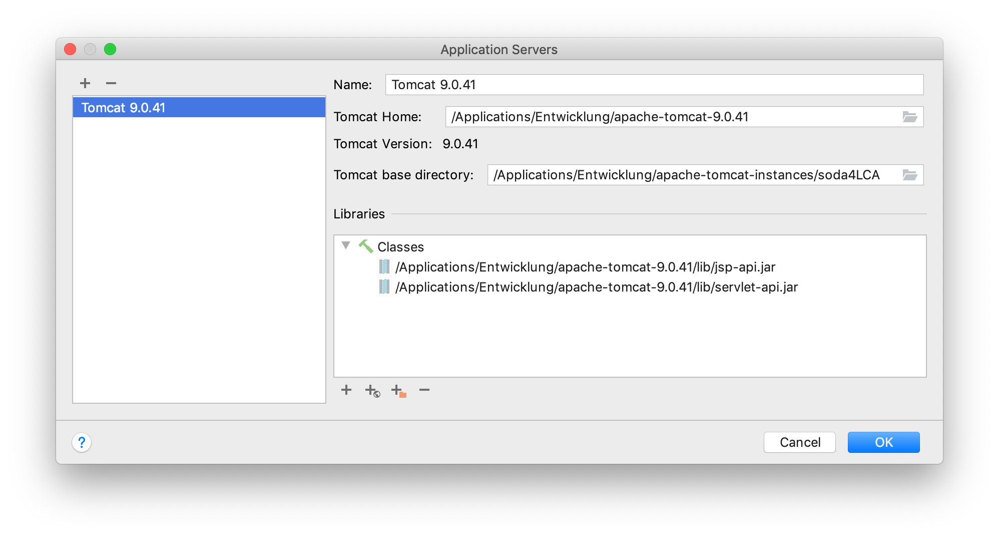
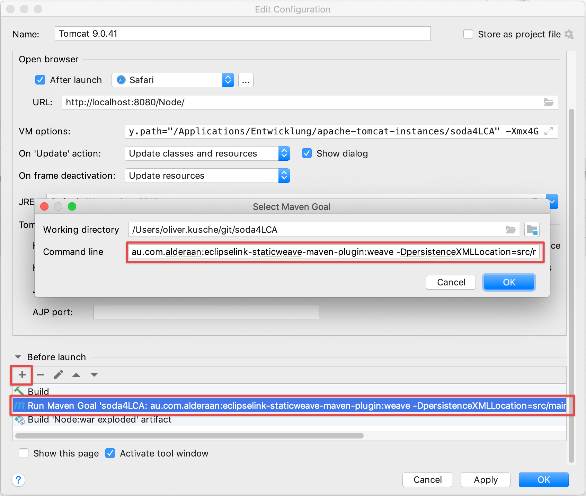
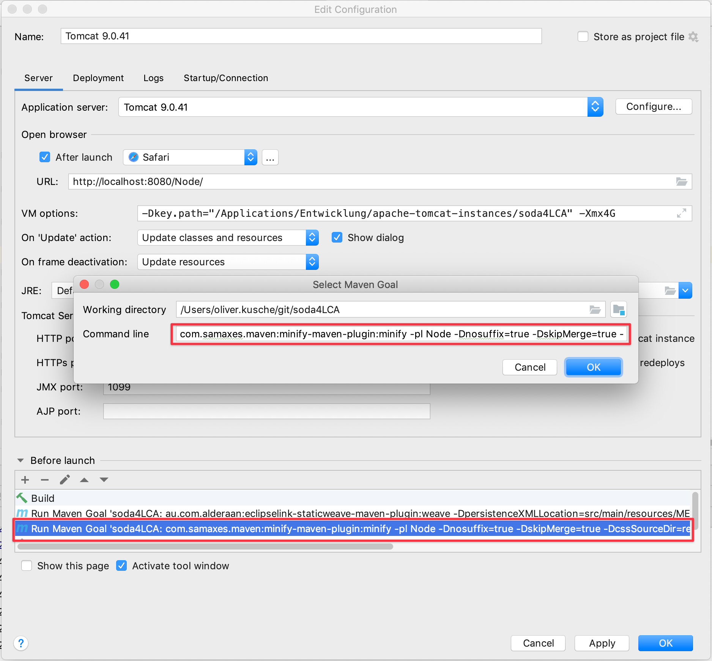

# IntelliJ IDEA Setup with Smart Tomcat plugin

##++ ***The first section of this guide covers the Smart Tomcat plugin. If you are using the Ultimate Edition of IntelliJ IDEA, scroll down to see the section "Setup with Ultimate Edition Tomcat Server Plugin"*** ++

## Install & configure Tomcat

1. [Download Tomcat](https://tomcat.apache.org/) and extract it
2. Download the Mysql Connector from [here](https://dev.mysql.com/downloads/connector/j/) and extract into the `$TOMCAT/lib/` folder
3. Edit `$TOMCAT/conf/server.xml` according to [Eclipse Setup](Eclipse_Setup.md)
4. Create a `$TOMCAT/conf/soda4lca.properties` file according to [Eclipse Setup](Eclipse_Setup.md)
5. Edit `$TOMCAT/conf/context.xml` according to [Eclipse Setup](Eclipse_Setup.md)


## Configure IntelliJ IDEA

1. Checkout the repository
2. Open the Project (File -> Open...) and select the repository
3. IntelliJ imports the maven project automatically. When it's finished, the Project-Panel should look something like that




### Configure Smart Tomcat

Then we need to install the `Smart Tomcat` plugin in IntelliJ (File -> Settings and then Plugins).

To create a new Run configuration click on `Add configurations...` on the top right side of the IDE.


1. Click on the Plus Symbol and select Smart Tomcat.
2. In the line for Tomcat Server, click on `configure` and select your tomcat folder, save and select the newly configured Tomcat in the run configuration panel
3. In the next line `Deployment..` select the `Node/src/main/webapp` folder
4. Set the context path to `/Node`


Now you should be able to successfully run the configuration by selecting it and clicking the Run button.



**If not, run `mvn idea:idea` in the project root and wait until IntelliJ has reloaded the project before you try it again**.


# Setup with Ultimate Edition Tomcat Server Plugin #

## setup soda4LCA in IntelliJ IDEA

Create a separate folder somewhere for the Tomcat configuration (Tomcat Base directory) that is specific for this instance, this way we won't have to touch the Tomcat Home directory.

Copy the `conf` folder from the Tomcat Home directory there.




We're adding the `Node`  module as `war exploded`  and set the context path to `/Node`:


In order to have IDEA execute the static weaving on the compiled classes when
running the application from inside the IDE, we add an extra step under 
"Before launch" by adding a new task "Run Maven Goal" and enter the following
into the "Command line" text box: 

`de.empulse.eclipselink:staticweave-maven-plugin:weave -DpersistenceXMLLocation=src/main/resources/META-INF/persistence.xml -Dsource=target/classes/ -pl Node`





Then we add a second step which executes the CSS and JS minification (which are 
otherwise absent from the build artifact created by IDEA) by adding another
"Run Maven Goal" entry in the same place with the value of "Command line" being:

`com.samaxes.maven:minify-maven-plugin:minify -Dnosuffix=true -DskipMerge=true -DcssSourceDir=resources/css -DcssSourceIncludes="**/*.css" -DjsSourceDir=resources/js -DjsSourceIncludes="**/*.js,**/*.min.js" -pl Node`





We also disable all log files as all output will be directed to the console:


Under "VM Options" we want to add a system property that points to our Catalina base folder in order for the keys that are generated during Tomcat startup are not lost upon restart (which would prevent the "remember me" functionality from working):

`-Dkey.path="/path/to/your/CATALINA_BASE/directory"`


Now go the "Project Structure" dialog and add the `conf` folder inside our Tomcat Base directory as an additional Content Root of the `soda4LCA` module:


Now we can conveniently edit our config files from the Project Explorer.


Which we will do right away: open `context.xml`  and uncomment this to disable session persistence across Tomcat restarts:

```
<Manager pathname="" />
```

then add an environment variable that points to your soda4LCA.properties:

```
<Environment name="soda4LCAProperties"
             value="/path/to/your/CATALINA_BASE/directory/conf/soda4LCA.properties"
             type="java.lang.String" />
```

Put your soda4LCA.properties into this folder and add the database connection to the `server.xml` .


In Tomcat logging.properties for this instance, we want to set both the `handlers` and `.handlers` properties in order to direct all output to the console. Replace the contents of the `logging.properties` file with these lines:

```
handlers = java.util.logging.ConsoleHandler

.handlers = java.util.logging.ConsoleHandler
```


Then we add a shortcut to compile and reload a class on Ctrl+S when running the application in Debug Mode::


