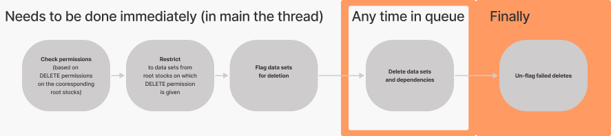


 A (non-trivial) tasking example:
 ------------------
Implementing asynchronous deletion of data sets
===============================================

Most data sets are far from being independently represented within our data model.
Indeed, a data set typically depends on other data sets, which in turn are no more independent themselves. 
And of course, the data set itself may very well be a dependency to another. Needless to say, deletion is a
fairly complex (and hence time-consuming) endeavour. This, together with some hidden complexities, makes it a decent 
example for how tasks can be implemented in soda4LCA.

### What using the delete task will look like in the end
```java
@ManagedBean
public class SomeBean extends AbstractHandler {
    
    // ...
    
    public void deleteMethod() {
        // User input
        DataSet[] selectedDataSets = getSelectedDataSets();
        DependenciesMode depMode = getDepMode();
      
        // Running the task
        DeleteTask.from(selectedDataSets, depMode, getUser())
                .runIn(getGlobalQueue())
                .message(this, true); // optional
    }
    
    // ...
    
}
```
The user provides a selection of data sets, picks a dependency strategy from the corresponding enum
`DependenciesMode`. We may initialise the task by this data together with the user as signee.
The task can then be run given a queue that is managed by Spring, and, optionally, we can add FacesMessages
to the Bean (`this`), where the boolean flag `true` allows the task to automatically print the run-log into
the console (if there is a run-log).

### What we will need to do
Obviously, we need to write the `DeleteTask` class, which will be an extension of the abstract class
```java
public abstract class AbstractDataSetLoggingTask<T> extends AbstractLoggingTask<T, DataSetReferencingRunLog> {
    
    // ...
 
}
```

We will need to implement some abstract methods here, of which the most central will certainly be the super-class
method

```java
public abstract class AbstractTask<T> {
    
    // ...
    
    protected abstract TaskResult process(T data) throws TaskRunException;
 
    // ...
}
```

This will be the method ultimately called according to our processing strategy, e.g. it may be called
by some executor in some queue at some point in the future. There, the data needs to be accessible through a
single class `T`, i.e. it needs to be bundled. So we're going to write a class
``DeleteTaskDataBundle`` which holds all the data to the tasks specific goal. A decent first sketch could be:
```java
public class DeleteTaskDataBundle {

 private DataSet[] dataSets;

 private DependenciesMode depMode;

 // Constructor, getters, setters
}
```
*Please note* that there's nothing about the user or any queue in there. Task implementations *don't need to worry about*
the logic for *running things* too much. They just pick a strategy from the corresponding enum `TaskProcessingStrategy`
when implementing

```java
public abstract class AbstractTask<T> {
    
    // ...
 
    protected abstract TaskProcessingStrategy determineProcessingStrategy(T data);
 
    // ...
}
```

and that's it. It could be as simple as:

```java
public class DeleteTask extends AbstractDataSetLoggingTask<DeleteTaskDataBundle> {
    
    // ...
 
    protected TaskProcessingStrategy determineProcessingStrategy(T data) {
        return TaskProcessingStrategy.IMMEDIATELY;
    }
    
    // ...
 
}
```

Before we begin implementing the `DeleteTask` by writing the `DeleteTaskDataBundle` class,
it makes sense however, to discuss the problems with asynchronous deletion.

### Understanding the intricacies of the task first
Since the data sets will be deleted asynchronously, views don't freeze, which is of course the goal, but this also 
leads to them being potentially outdated. The user will very likely be confronted with data that don't exist
anymore. Furthermore, interaction with these data sets will lead to all kinds of confusing errors!

So before we start deleting, we want to flag all selected datasets for deletion. The UI
in turn will not display those. Since flagging data sets for deletion is ultimately a `WRITE` operation,
we may want to immediately include appropriate authorisation checks, which depend on the corresponding
data stock.





If the user has the authorisation for some data stocks, but hasn't for others, we want to
proceed with the subset of data sets, where deletion is allowed. Hence, it makes sense to group
the selected data sets by the root data stocks that contain them.

## Creating the data bundle class
By the considerations in the previous subsection we group data sets by the containing root stock. It may 
also make sense to only store references to the data sets, since ultimately, per data set, we will need only the
dao and the id to perform the deletion. And, of course, uuid, version and type should do well enough for logging.
```java
public class DeleteTaskDataBundle {

    private Map<RootDataStock, DataSetReference[]> dataSetsByStock;

    private DependenciesMode depMode;

    // Constructor, getters, setters, convenience methods (e.g. getter for flattened map)

}
```

## Implementing the task

So let's dive right in, we pick our `DeleteTaskDataBundle` and a default implementation of a TaskRunLog: 
`DataSetReferencingRunLog`. There is another called `DefaultRunLog` which is more simple and usually enough,
but our choice is more suitable here. The `DefaultRunLog` is not to much more than
a String that can be written comfortably while running a task and in a way that will make sense to the human
reader later on. The `DataSetReferencingRunLog` additionally keeps references to the processed 
data sets, grouped by the LogLevel (`SUCCESS`, `INFO`, `ERROR`), which we will need later on.
```java
public class DeleteTask extends AbstractDataSetLoggingTask<DeleteTaskDataBundle> {

    public DeleteTask(DeleteTaskDataBundle data, User signee) {
        super(data, signee);
    }

    /////////////////////
    // For Convenience //
    /////////////////////

    public static DeleteTask from(DataSet[] dataSets, DependenciesMode depMode, User signee) {
        DeleteTaskDataBundle dataBundle = new DeleteTaskDataBundle(dataSets, depMode);
        return new DeleteTask(dataBundle, signee);
    }
}
```

### Implementing the inherited abstract methods.
#### Describing the task
The description of the task is used in the printed log and/or the job overview. It is actually quite essential to
differentiate between task instances, or, ideally, identify the goal of a specific task instance. Usually, it
should therefore be based on the data in the data bundle.

Let's base it, maybe a bit clumsily, on the *number* of data sets that shall be deleted and the dependency mode, and 
let's hope that it's striking the right balance between being overly verbose and still providing enough detail.
```java
public class DeleteTask extends AbstractDataSetLoggingTask<DeleteTaskDataBundle> {
    
    // ...

    @Override
    protected String getDescription(DeleteTaskDataBundle data) {
        return "Deletion of "
            + data.getAllDataSetReferences().length
            + " data sets, with dependencies mode: "
            + data.getDependenciesMode();
    }
    
    // ...
}
```
#### Instantiating the run-log
Since we're doing an operation on a collection of data sets, it makes sense to simply extend 
<code>AbstractDataSetLoggingTask</code> which handles instantiation of a suitable run-log and offers
some convenience methods.

```java
public class DeleteTask extends AbstractDataSetLoggingTask<DeleteTaskDataBundle> {
    
    // ...
 
}
```

Alternatively one would need to provide the run-log instance by hand, which is done by implementation
of the given abstract method, e.g.

```java
public class DeleteTask extends AbstractLoggingTask<DeleteTaskDataBundle, CustomRunLog> {
    
    // ...
 
     @Override
     protected CustomRunLog initTaskLog() {
         CustomRunLog runLog = new CustomRunLog();
         runLog.setVerbose(false);
         return runLog;
     }
    
    // ...
}
```

#### Picking the processing strategy
We base our decision on the provided data: some deletions should still
be carried out immediately. So we add fields

```java
public class DeleteTask extends AbstractDataSetLoggingTask<DeleteTaskDataBundle> {

    private static final int LARGE_WORKLOAD = 15;
    
    private static final int LARGE_WORKLOAD_DEPENDENCY_NIGHTMARE = 3;
 
    // ...
}
```

and implement the abstract method:

```java
public class DeleteTask extends AbstractDataSetLoggingTask<DeleteTaskDataBundle> {
    
    private static final int LARGE_WORKLOAD = 15;
    
    private static final int LARGE_WORKLOAD_DEPENDENCY_NIGHTMARE = 3;
    
    // ...
 
    @Override
    protected TaskProcessingStrategy determineProcessingStrategy(DeleteTaskDataBundle data) {
        boolean dependencyNightmare = false; // LCIA-methods and processes can be resource intensive to delete
        if (!(DependenciesMode.NONE.equals(data.getDependenciesMode()))) {
            for (DataSetReference ds : data.getAllDataSetReferences()) {
                if (DataSetType.PROCESS.equals(ds.getType()) || DataSetType.LCIAMETHOD.equals(ds.getType())) {
                    dependencyNightmare = true;
                    break; // one process or LCIA method can already be enough of a nightmare!
                }
            }
        }

        int largeWorkload = dependencyNightmare ? LARGE_WORKLOAD_DEPENDENCY_NIGHTMARE : LARGE_WORKLOAD;
        if (data.getAllDataSetReferences().length < largeWorkload)
            return TaskProcessingStrategy.IMMEDIATELY;

    return TaskProcessingStrategy.BACKGROUND_QUEUE;
    }

    // ...
}
```

#### Writing out the deletion and interpreting the results
Now for the central method:
```java
public class DeleteTask extends AbstractDataSetLoggingTask<DeleteTaskDataBundle> {
    
    private static final int LARGE_WORKLOAD = 15;
    
    private static final int LARGE_WORKLOAD_DEPENDENCY_NIGHTMARE = 3;
    
    // ...
 
    @Override
    protected TaskResult process(DeleteTaskDataBundle data) throws TaskRunException {
         LogLevel logLevel;
         for (DataSetReference ref : data.getAllDataSetReferences()) {
          dsDeleteSuccess = delete(ref, data.getDependenciesMode());
          logResult(ref, dsDeleteSuccess);
         }

         return new TaskResult(TaskStatus.COMPLETE);
    }

    private LogLevel delete(DataSetReference dataSetReference, DependenciesMode depMode) {

        // ...
        // fetch dependencies according to depMode, delete them, delete the data set afterwards
        //...

        return logLevel;    // If data set couldn't be deleted: ERROR
                            // If it has been deleted but not all dependencies: INFO
                            // else data set and dependencies have been deleted: SUCCESS
    }

    private void logResult(DataSetReference ref, LogLevel logLevel) {
        if (LogLevel.INFO.equals(logLevel))
            getRunLog().incrementInfosCount(ref);
        else if (LogLevel.SUCCESS.equals(logLevel))
            getRunLog().incrementSuccessesCount(ref);
        else
            getRunLog().incrementErrorsCount(ref);
    }
 
    // ...
}
```

### Pre-processing/-running the task
If it weren't for the intricacies of the `DeleteTask`, we would be done after the previous subsection. But we want to
flag the data sets for deletion and check for permissions beforehand. All of which shall be done in the
main-thread and quite immediately so. This can be achieved by overriding two non-abstract methods of the `AbstractTask` 
class on which `AbstractLoggingTask` is based. Both are called before anything else is getting done.

First things first, there is a method that handles checking of permissions (and is called pretty early on):

```java
public class DeleteTask extends AbstractDataSetLoggingTask<DeleteTaskDataBundle> {
    
    // ...
 
    @Override
    protected void assertCanImmediately(DeleteTaskDataBundle data, User signee) throws AuthorizationException {
        super.assertCanImmediately(data, signee);
            // Let's make sure write permissions are enough to flag for deletion!
        for (RootDataStock rootStock : data.getReferencesByStock().keySet()) {

            // ...
            // Assert can DELETE!
            // otherwise remove Entry<RootDataStock, DataSetReference[]> from the map in the data bundle
            // ...

            appendToLogAppendix("Will ignore data sets from stock: "
                    + rootStock.getName()
                    + " ("
                    + rootStock.getUuidAsString()
                    + ") because of missing authorisation.");

        }

        if (data.getReferencesByStock().keySet().isEmpty())
            throw new AuthorizationException();
    }

    // ...
}
```

The second method we are going to override is going by the name `preProcessImmediately`. This is where we're going to
flag the data sets for deletion.

```java
public class DeleteTask extends AbstractDataSetLoggingTask<DeleteTaskDataBundle> {
    
    // ...
 
    @Override
    protected void preProcessImmediately(DeleteTaskDataBundle data, User signee) {
        super.preProcessImmediately(data, signee);

        // flag data sets for deletion
        Map<DataSetDaoType, List<DataSetReference>> referencesByDaoType =
                Arrays.stream(data.getAllDataSetReferences())
                        .collect(Collectors.groupingBy(DataSetReference::getDaoType));

        for (DataSetDaoType daoType : referencesByDaoType.keySet())
            daoType.getDao().flagForDeletion(referencesByDaoType.get(daoType));
    }

    // ...
}
```

### Post-processing the task
If the deletion of a data set fails it is pretty safe to assume that it's already flagged for deletion. That means it
will no longer appear in the UI or be exposed to any API calls. One could make a point for this being a feature. 
However, it seems to be more coherent to un-flag them: at least, since they've certainly got logged as fails, 
one may become suspicious of them being gone nonetheless.

This is where our choice of run-log implementation matters:

Run logs are always automatically included in the `TaskResult`. But they have a tendency to be not much more than a 
String into which all data has been forged so that human beings may read it. The `DataSetReferencingRunLog`, however, 
holds `DataSetReferences` grouped by `LogLevel`. Therefore, we can easily obtain references to failed deletions and
un-flag them.

All we need to do is override the method `postProcessFinally` of the `AbstractTask` on which the
`AbstractLoggingTask` is based.

```java
public class DeleteTask extends AbstractDataSetLoggingTask<DeleteTaskDataBundle> {

    // ...

    @Override
    protected TaskResult postProcessFinally(DeleteTaskDataBundle data, User user, TaskResult result) {
        result = super.postProcessFinally(data, user, result);
        
        Set&lt;DataSetReference&gt; failedDeletes = ((DataSetReferencingRunLog) result.getRunLog())
                .getReferences(LogLevel.ERROR);

        // flag data sets for deletion
        Map<DataSetDaoType, List<DataSetReference>> referencesByDaoType =
                Arrays.stream(data.getAllDataSetReferences())
                        .collect(Collectors.groupingBy(DataSetReference::getDaoType));

        for (DataSetDaoType daoType : referencesByDaoType.keySet())
            daoType.getDao().unflagForDeletion(referencesByDaoType.get(daoType));
        
        return result;
    }


    // ...
}
```
