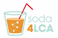

# soda4LCA General Data Protection Regulation (GDPR) Compliance Guide

General information
===================

Intended audiences
------------------

This guide is aimed at node administrators and gives detailed step-by-step 
instructions on how to set up a new node/re-configure an existing node in order
to meet the requirements of the General Data Protection Regulation (GDPR).

Why this guide?
---------------

soda4LCA, when used with the user registration feature, will ask registering
users for personal data (such as name, email address, organization etc.) that 
is stored within the application. In order to comply with the GDPR, the 
operator of the application will need to be able to prove that users have
given their consent to the organization's privacy statement. 

With the 4.3.0 feature release of soda4LCA, new as well as existing users can
be required to accept the privacy statement when registering (or logging in for
existing users). This information will be persisted. 

Furthermore, in the page footer of the application's web interface, links to 
pages for imprint and privacy statement can be configured. 

Prerequisites
-------------

This guide assumes you have already upgraded your instance to the 4.3.0 release.
 

Before you get started
======================

You should have the following ready:

- The privacy statement of your organization in either text or HTML or 
  already existing on an external website where it is accessible via hyperlink.
  
- (optional) The imprint of your organization in either text or HTML or already existing 
  on an external website where it is accessible via hyperlink.
    
The soda4LCA application employs the following features that are relevant for your 
privacy statement:

1. Session cookies for keeping information on language setting and login status

2. (if configured) User registration where users can register in order to
   gain access to certain data. This includes the following data that users can specify:
   
    a. Email address
   
    b. Name
   
    c. Title
   
    d. Sex

    e. Position
   
    f. Organization
   
    g. Work address
   
    h. (if configured) Industrial sector 
	   
	        
   
Preparing imprint and privacy statement
=======================================

### 1. Decide the way you want to present the privacy statement/imprint ###

There are two possible options:
   
**(A) Inline** - the respective information will be shown on dedicated pages
             *within* the soda4LCA Node application.

**(B) External** - the respective information resides on a website external to
             the soda4LCA Node application. The soda4LCA Node application
             will merely display hyperlinks that lead to the contents on 
             the external website.
   	              
   	              
If you chose option (B), skip to section 3 below.

### 2. If you chose option (A) ###

1. Using the file `html_fragment_template.html` as a template, create a  
    file that contains your desired content for imprint/privacy statement.
    You can use HTML markup. Make sure the file is merely an HTML fragment
    (without any outer `html` and `body` tags).
                     
2. Put these files somewhere on a web server of your choice and note the
     respective URLs.
    
3. (optional) If you want these to reside on and be served by the Tomcat
    instance that your soda4LCA application is running on, you can 
    optionally do the following:

    a. Create a folder for the static content on your server, for example `/usr/local/soda_data/static`.
    b. Copy the files from above to that folder.
    c. In the `server.xml` of your Tomcat instance, add a new line within the section `Host`:

        <Context docBase="/usr/local/soda_data/static"  path="/static" />
   
    d. Restart your Tomcat instance. The static files will now be available under a URL like this

        http://<servername>.<tld>/static/imprint.html

    assuming the HTML fragment file with the imprint has been named `imprint.html`.

### 3. If you chose option (B)###

Note the absolute URLs of your imprint and privacy statement pages on your 
external website. 

Adding necessary configuration options
======================================

1. Add the following lines to your `soda4LCA.properties`:

        content.static.imprint.url = <absolute URL to your imprint>
        content.static.privacypolicy.url = <absolute URL to your privacy statement>

    for example 

        content.static.imprint.url = http://www.acme.org/static/node_imprint.html
        content.static.privacypolicy.url = http://www.acme.org/static/node_privacy_policy.html

    If you chose option (A) above, add the additional two lines:

        content.static.imprint.url.fragment = true
        content.static.privacypolicy.url.fragment = true
        

2. If you're using the user registration feature, add the following line in
   addition:

        user.registration.privacypolicy.accept = true

    This will require newly registering users as well as returning existing users
    to accept your privacy statement before being able to complete the 
    registration/logging in. 

3. Restart your Tomcat instance. Now the links will be displayed in the page
   footer.
   

Extracting information on users
===============================

If you need to review which users have given their consent to the privacy 
statement, you can navigate to the "Manage users" view when logged in as admin.
There, you can also export the list of users as XLS file, which contains an 
extra column with that information. 

    
    
    
