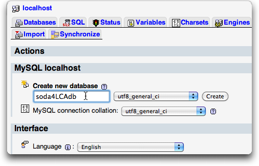
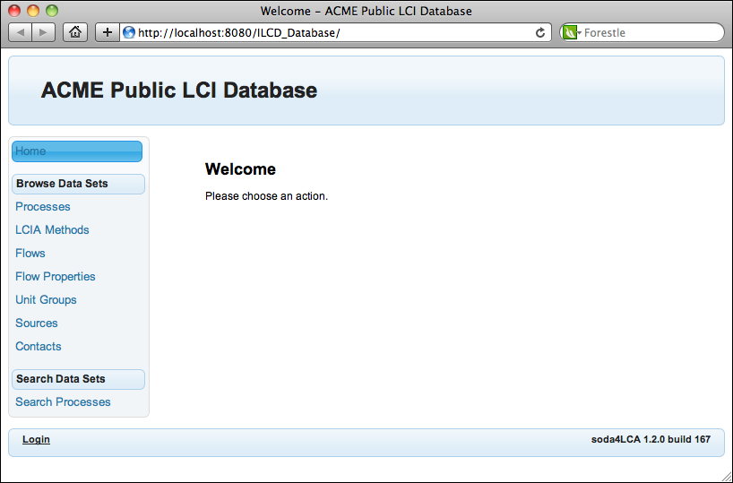
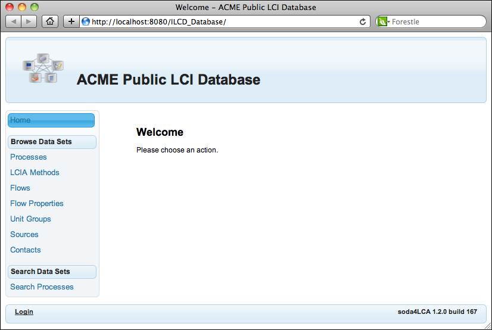

# soda4LCA Installation and Configuration Guide


General information
===================

Intended audiences
------------------

This guide gives detailed step-by-step instructions on how to set up a
soda4LCA database node. It is intended for network and website managers.

System prerequisites
--------------------

This software is conceived as a web application and runs inside a
servlet container such as Apache Tomcat. The following components must
already be in place in order to install and run soda4LCA:

-   Java 11 (newer versions may also work but have not been extensively tested) 

-   MariaDB 10.11 or MySQL 8.x database (recommended: MariaDB 10.11)

-   J2EE servlet container (recommended: Tomcat 9)

The instructions and configuration examples are for Tomcat 9. If you
use another servlet container or Tomcat version, the necessary
instructions may differ, in that case consult the container's
documentation. The application will not run on Tomcat 6 anymore.

The guide refers to the base directory of the Tomcat installation as
`$CATALINA_HOME`.


Note that on debian-based systems (like Ubuntu), the Tomcat files may be 
spread across various folders:

`/etc/tomcat8/` (`server.xml`, `soda4LCA.properties`)

`/var/lib/tomcat8/` (`webapps` folder with `Node.war`)

`/usr/share/tomcat8/` (`lib` folder for `mysql-connector.jar`)


Upgrading
=========

Upgrading from soda4LCA 3.x or newer to a higher release
--------------------------------------------------------

When upgrading to a newer release from a 3.x version or newer, all you need to
do is to stop the servlet container (Tomcat), replace the `Node.war` in your 
Tomcat's `webapps` folder with the one from the newer build, remove the `Node`
folder in `webapps` and restart the container.  
 
**This only works in one direction, downgrading is not supported, so be sure to
back up your previous `Node.war` AS WELL AS YOUR DATABASE before upgrading!** 

### Backing up your database

To back up your database (**before** you upgrade!), you can use the `mysqldump` utility:

```shell
mysqldump -u [mysql-username] -p --routines -r [dump_filename] [database_schema_name]
```

You will then be prompted for the password. It is possible to avoid being 
prompted for a password by appending it to `-p`, e.g: `-pmypassword`. For 
security reasons, it is not recommended though to specify passwords on the
command line.

On debian-style Linux systems such as Ubuntu, you can skip the username and
password parameters if you have superuser privileges:

```shell
mysqldump --defaults-extra-file=/etc/mysql/debian.cnf --routines -r [dump_filename] [database_schema_name]
```

Always include the --routines switch to make sure stored procedures and 
triggers are exported as well.

**If you use any other tool, make sure that export of stored procedures and triggers is
activated, as this is often disabled by default.**


### Migrating from a Windows to a Linux/BSD machine

When migrating an instance from a Windows OS to an OS with a case-sensitive 
file system such as Linux, due to different [platform defaults](https://dev.mysql.com/doc/refman/5.7/en/identifier-case-sensitivity.html)
for MySQL you'll have to manually change the names of some tables. Immediately
after importing the database (and **before** you start the application for the
first time), issue these statements on your database:

```sql
SET FOREIGN_KEY_CHECKS=0;
ALTER TABLE `contact_description` RENAME TO `Contact_DESCRIPTION`;
ALTER TABLE `contact_name` RENAME TO `Contact_NAME`;
ALTER TABLE `flow_description` RENAME TO `Flow_DESCRIPTION`;
ALTER TABLE `flow_name` RENAME TO `Flow_NAME`;
ALTER TABLE `flowproperty_description` RENAME TO `FlowProperty_DESCRIPTION`;
ALTER TABLE `flowproperty_name` RENAME TO `FlowProperty_NAME`;
ALTER TABLE `lciamethod_description` RENAME TO `LCIAMethod_DESCRIPTION`;
ALTER TABLE `lciamethod_name` RENAME TO `LCIAMethod_NAME`;
ALTER TABLE `process_name` RENAME TO `Process_NAME`;
ALTER TABLE `process_description` RENAME TO `Process_DESCRIPTION`;
ALTER TABLE `source_description` RENAME TO `Source_DESCRIPTION`;
ALTER TABLE `source_name` RENAME TO `Source_NAME`;
ALTER TABLE `source_shortname` RENAME TO `source_shortName`;
ALTER TABLE `unitgroup_description` RENAME TO `UnitGroup_DESCRIPTION`;
ALTER TABLE `unitgroup_name` RENAME TO `UnitGroup_NAME`;
SET FOREIGN_KEY_CHECKS=1;
```


Upgrading from soda4LCA 1.x or 2.x to soda4LCA 3.x
--------------------------------------------------

For an upgrade of a pre-3.x release to a 3.x release, the database
schema must be completely emtpy. Make sure you export your data before
wiping your database schema. Any user accounts need to be recreated once
the upgrade is complete.

To upgrade your soda4LCA installation from a previous (2.x) release to
3.x, follow these steps:

1.  Export your data (see section `"Export"` in the Administration Guide
    for detailed instructions) and save the resulting ZIP file.

2.  Stop the servlet container (Tomcat).

3.  Your application's database schema needs to be completely empty
    before you start up the 3.x release. The easiest way is to drop and
    re-create your database schema. For instance, if the name of your
    database schema is `soda4LCAdb`, executing the following statements
    will ensure your database schema is empty:

        DROP SCHEMA soda4LCAdb;

        CREATE SCHEMA soda4LCAdb DEFAULT CHARACTER SET utf8;                                
                                    

4.  Locate the application's folder inside the
    `$CATALINA_HOME/webapps` folder. The name of this folder matches
    your application's context path. For instance, if your application'
    context path is `/Node`, there will be a folder `Node`. Delete that
    (and only that) folder.

5.  Change the name of the soda4LCA 2.x WAR archive to match your
    context path. For example, if your context path is `/Node`, name it
    `Node.war`. Then copy it to `$CATALINA_HOME/webapps`, overwriting
    the existing WAR file.

6.  Now start the servlet container (Tomcat).

7.  Once the application is up and running, log in as `admin` and change
    the default password.

8.  Now you can import your data using the ZIP file created in step 1.
    Refer to the section `"Import"` in the Administration Guide for
    detailed instructions.


Preparing the environment
=========================

Database SQL mode and system variables
--------------------------------------

If you are using MySQL 5.7 or newer, the `ONLY_FULL_GROUP_BY` option has
to disabled for the application to run properly. 

For being able to import large datasets into the database application,
the `max_allowed_packet` system variable needs to be adjusted in your
MySQL instance.

-   `sql_mode="STRICT_TRANS_TABLES,NO_ZERO_IN_DATE,NO_ZERO_DATE,ERROR_FOR_DIVISION_BY_ZERO,NO_AUTO_CREATE_USER,NO_ENGINE_SUBSTITUTION"`
-   `max_allowed_packet=25M`

Depending on your operating system and MySQL installation type, there
are different ways to apply these settings. You can either add or replace
the above line to your `my.cnf` or alternatively pass them as command
line parameters in MySQL's startup script like this
`--sql-mode="STRICT_TRANS_TABLES,NO_ZERO_IN_DATE,NO_ZERO_DATE,ERROR_FOR_DIVISION_BY_ZERO,NO_AUTO_CREATE_USER,NO_ENGINE_SUBSTITUTION" --max_allowed_packet=25M`.

(If there doesn't exist a file called my.cnf or there exist only soft links called "my.cnf", then open the directory that contains a file named `mysql.cnf`.If there already exists a soft-link of the file my.cnf then remove the soft-link. Now copy the file `mysql.cnf` into the same folder and rename the new generated file to `my.cnf`. Then open the file and add the following line to the bottom of the document: 
`[mysqld]`
Then you can add the variables named above.)

Another way of achieving this is to add this option to the connection string in
your server.xml as described below in "Basic application setup".


Recommended: Increasing heap size for Tomcat's Java Virtual Machine
-------------------------------------------------------------------

To ensure optimum performance of the soda4LCA application, the heap size
of the Java Virtual Machine should be increased to at least 400 MB (more
is better). This can be achieved by setting the `CATALINA_OPTS` environment
variable to `-Xmx400M`. For very large databases with several thousand 
datasets, multiple gigabytes will be a good choice, e.g. `-Xmx4G`.


Installing the application
==========================

Database setup
--------------

1.  Create a new, empty database schema using a UTF-8 character set and
    the default collation. For example, when using phpMyAdmin, use the
    "Create new database" section on the main page:

    

    The database schema name used in all the examples is `soda4LCAdb`.
    If you are using a different schema name, be sure to change it
    accordingly in any sample code you may be copying from this manual.

2.  Obtain and install MySQL database driver

    1.  Download the MySQL database driver here:
        <http://dev.mysql.com/downloads/connector/j/>.

    2.  Unpack it and place the `mysql-connector-java-8.x.xx-bin.jar`
        file into the `$CATALINA_HOME/lib` folder.

Basic application setup
-----------------------

These instructions are for setting up a single instance of the
application. If you require multiple instances running inside the same
container, follow the instructions in the section "[Advanced application setup](#advanced-application-setup)".

1.  Add the following declaration to the `<GlobalNamingResources>`
    section of your `$CATALINA_HOME/conf/server.xml` and adjust username
    and password and, if necessary, the database URL accordingly:

        <Resource auth="Container" 
             driverClassName="com.mysql.cj.jdbc.Driver" 
             maxIdle="4" 
             validationQuery="SELECT 1" 
             testOnBorrow="true" 
             removeAbandoned="true" 
             removeAbandonedTimeout="300" 
             logAbandoned="true" 
             name="jdbc/soda4LCAdbconnection" 
             type="javax.sql.DataSource" 
             url="jdbc:mysql://localhost/soda4LCAdb?useUnicode=yes&amp;characterEncoding=UTF-8&amp;useSSL=false" 
             username="myusername" 
             password="mypassword"
        />

    If you're using MySQL 5.7+ and haven't changed the `SQL_MODE` globally, use the following connection string 
		
	`url="jdbc:mysql://localhost/soda4LCAdb?useUnicode=yes&amp;characterEncoding=UTF-8&amp;sessionVariables=sql_mode='ERROR_FOR_DIVISION_BY_ZERO,NO_AUTO_CREATE_USER,NO_ENGINE_SUBSTITUTION'"` 

3.  (optional) To avoid NotSerializableExceptions during Tomcat
    restarts, session persistence can optionally be disabled by
    uncommenting the line `<Manager pathname="" />` in the
    `context.xml` file.

4.  To configure the application, a properties file providing
    information about node name etc. is required. Using
    `soda4LCA.properties.template` (in the Installation\_Guide folder of
    the documentation) as a template, create the application's
    configuration file and place it into
    `$CATALINA_HOME/conf/soda4LCA.properties`. For detailed step-by-step
    instructions, refer to the section [Configuring and customizing a node](#configuring-and-customizing-a-node).

***
 **IMPORTANT!**

 Ensure to configure the `files.location.datafiles` properties in the
 "data and temp directories" section of your `soda4LCA.properties` to
 point somewhere outside the directory containing web application,
 otherwise you will lose your data (external files attached to source
 datasets) on re- or undeploy! See the section [Data and temporary directories](#data-and-temporary-directories) 
 section in the
 "Configuring and customizing a node" chapter for details.
***


HTTP(S) Proxy
-------------

If your environment requires working with an HTTP and/or HTTPS proxy, you can
set the environment variables `http_proxy` and/or `https_proxy` with a value
in the format `hostname[:port]`, where `port` defaults to `80` for
`http_proxy` and to `443` for `https_proxy` if not specified.


Installation using Docker
-------------------------

Another option is to use the [official](https://hub.docker.com/r/okworx/soda4lca) Docker image to run the application. 
The image contains a configured Tomcat which only needs access to a MySQL Server. The connection is being configured by following environment variables:

### Database Settings

```
MYSQL_HOST      = <ip or hostname of mysql server>
MYSQL_PORT      = <mysql port>
MYSQL_USER      = <mysql user>
MYSQL_PASSWORD  = <mysql password>
MYSQL_DATABASE  = <database to use>
```

### Mail Settings

(Optional) Enable activation emails during signup process.

```
SODA_MAIL_SENDER    = <sender email (abc@xyz.de)>
SODA_MAIL_HOST      = <SMTP host>
SODA_MAIL_PORT      = <SMTP port (25)>
SODA_MAIL_SITENAME  = <site name that appears in mail>
SODA_MAIL_AUTH      = <toggle authentication (true | false)>
SODA_MAIL_USER      = <user name of the mail sender>
SODA_MAIL_PASSWORD  = <password of the mail sender>
```

### Tomcat Settings

Specify port where servlet container is exposed.

```
CATALINA_PORT   = <port where node listens for incoming connections on (8080)>
```

### GLAD Settings
(Optional) Enables access to *GLAD* network.

```
SODA_GLAD_APIKEY = <API key provided by GLAD admin>
```

### CAPTCHA Settings

(Optional) Enables captcha challenge during new account registration.

```
 WEB_PUBLIC_CAPTCHA     = <PUBLIC TOKEN>
 WEB_PRIVATE_CAPTCHA    = <PRIVATE TOKEN>
```

### SSL/TLS Settings
(Optional) Override the default keys in `/usr/local/tomcat`:

* `cipher.key`
* `private.key`
* `public.key`

```
SECRET_CIPHER_KEY   = <cipher.key as base64>
SECRET_PRIVATE_KEY  = <private.key as base64>
SECRET_PUBLIC_KEY   = <public.key as base64>
```
\* if they are not set, their encoded values will be written to `/soda/keys.env` on the initial run. which can be directly copied as environment variables.

```bash
$ cat /soda/keys.env

# keys.env:
# this file contains a base64-encoded copy of the
# secret keys (cipher, private, public) used by tomcat.
# you can set theses vars in your environment to prevent
# tomcat for generating new keys from scratch.

SECRET_CIPHER_KEY=rO0ABXVyAAJb.....
SECRET_PRIVATE_KEY=rO0ABXNyABRq....
SECRET_PUBLIC_KEY=rO0ABXNyABRqYXZhLm1h...
```


The folder `/opt/soda` can be mounted. It contains the data directory and the `soda4LCA.properties` file which need to be persisted across container restarts and upgrades.
To change the `web.xml` of Tomcat you can mount the file `/opt/tomcat/config/web.xml` or the complete directory`/opt/tomcat/config`
and then edit the file.

The easiest way to deploy the application with docker is a `docker-compose.yml` file:

```yaml
version: "3"

services:
  soda:
    image: okworx/soda4lca:5.4.1
    ports:
      - "80:8080" #the internal port is 8080 and 80 is exposed
    environment:
      MYSQL_HOST: mysqld
      MYSQL_DATABASE: soda
      MYSQL_USER: root
      MYSQL_PASSWORD: <change me>
    volumes:
      #- "./soda4lca:/opt/soda"
  mysqld:
    image: mysql/mysql-server:5.7
    command: --bind-address=0.0.0.0 --character-set-server=utf8 --collation-server=utf8_general_ci --max_allowed_packet=25M --sql-mode="STRICT_TRANS_TABLES,NO_ZERO_IN_DATE,NO_ZERO_DATE,ERROR_FOR_DIVISION_BY_ZERO,NO_AUTO_CREATE_USER,NO_ENGINE_SUBSTITUTION"
    ports:
      - "3306:3306"
    environment:
      MYSQL_ROOT_PASSWORD: <change me>
      MYSQL_DATABASE: soda
      MYSQL_ROOT_HOST: "%"

```

Save this as `docker-compose.yaml` and run `docker-compose up` to run the application and MySQL server.
On first startup this may take a while due to database initialization.

The Docker container uses Java with Shenandoah support (a garbage collector algorithm),
this can be enabled by setting the environment variable `CATALINA_OPTS` (for more information have a look [here](https://wiki.openjdk.java.net/display/shenandoah/Main#Main-PerformanceGuidelinesandDiagnostics)): 

```
CATALINA_OPTS: -Xmx2G -XX:+UnlockExperimentalVMOptions -XX:+UseShenandoahGC -XX:ShenandoahGCHeuristics=compact -XX:ShenandoahUncommitDelay=1000 -XX:ShenandoahGuaranteedGCInterval=10000 -verbose:gc
```


Advanced application setup
--------------------------

### Multiple instances in the same servlet container

If you require multiple instance of the application running in the same
servlet container, individual database connections can be declared per-webapp by
editing the webapp's context configuration file in Tomcat's
`$CATALINA_HOME/conf/Catalina/localhost` folder. You can specify the
path to the configuration file for each instance using the
soda4LCAProperties environment via JNDI.

```
    <Context antiJARLocking="true" swallowOutput="true">
        <Resource auth="Container" 
            driverClassName="com.mysql.cj.jdbc.Driver" 
            maxActive="8" maxIdle="4" 
            validationQuery="SELECT 1" 
            testOnBorrow="true"
            removeAbandoned="true" 
            removeAbandonedTimeout="300" 
            logAbandoned="true" 
            name="jdbc/soda4LCAdbconnection" 
            type="javax.sql.DataSource"
            url="jdbc:mysql://localhost/soda4LCAdb?useUnicode=yes&amp;characterEncoding=UTF-8" 
            username="myusername" 
            password="mypassword"/>
        <Environment name="soda4LCAProperties" value="/path/to/soda4LCA.properties" type="java.lang.String"/>
    </Context>
```                    

> **Tip**
>
> It is a good idea to make the context configuration file immutable
> (using `chattr +i`), so it won't be overwritten by Tomcat when the
> context is redeployed.

### Support for slashes ("/") in category names

If any of your datasets' classification systems relies on categories
that include slashes ("/") as part of their name, a security setting has
to be adjusted when running on Tomcat to enable this.

***
**WARNING**

 This may pose a security issue, use at your own risk.
***

To enable this, you may either

-   Insert the following code in the web.xml that is inside Node.war:

```
        <context-param>
            <param-name>soda4LCA.systemproperty.org.apache.tomcat.util.buf.UDecoder.ALLOW_ENCODED_SLASH</param-name>
            <param-value>true</param-value>
        </context-param>
```

-   pass the `org.apache.tomcat.util.buf.UDecoder.ALLOW_ENCODED_SLASH`
    system property with the value `true` to your Tomcat container.

WAR file installation
---------------------

Now copy the `Node.war` file to `$CATALINA_HOME/webapps`. You may rename
the WAR file to whatever you wish, the name of the WAR file will match
your application's context path once deployed.

Startup the application
-----------------------

Once you have completed customizing the configuration file, start the
servlet container by executing `$CATALINA_HOME/bin/startup.bat` (on
Windows) or `$CATALINA_HOME/bin/startup.sh` (on macOS/*nix) and closely
observe the console output. If there are any errors, consult the
following section "Common problems" for information on how to resolve
them.

Once the application has started successfully, you can access the
application by pointing your browser to the URL

[`http://localhost:8080/Node/`](http://localhost:8080/Node/)

Please log in and immediately change the default administrator
password as described below.

***
**IMPORTANT!**

 The application ships with a default administrator password that has
 to be changed immediately upon successful installation in order to
 prevent unauthorized access.

 Once the application is up and running, log in with the administrative
 account (username: admin, password: default) and change the password
 (select "My Profile" in the footer bar and enter a new password in the
 respective fields of the following screen).
***


Common problems
---------------

### Error: application configuration properties not found

Make sure you have a soda4LCA.properties in place either at
`$CATALINA_HOME/conf/soda4LCA.properties` or at some other location with
a proper Environment entry in your Context configuration that points to
the location of the file.

### FATAL ERROR: could not determine base URL for service interface

If no hostname (and, optionally, port) have been declared in
soda4LCA.properties, the application will try to detect the hostname,
port and context path. If it cannot build a valid URL from the obtained
information, this error will be raised.

### Error: Cannot set nodeid/nodename from configuration file

This means the soda4LCA.properties configuration file does not contain
said information. Refer to the soda4LCA.properties.template for an
example configuration file.

### FATAL ERROR: database schema is not properly initialized

This error occurs when the application finds a database schema that is
corrupt or not compatible with the current application version. At first
setup, make sure the database schema is empty. Also, be sure you have
set the `lower_case_table_names` property correctly for your MySQL 
database instance as described in section [Database SQL mode and system variables](#database-sql-mode-and-system-variables).

### FATAL ERROR: could not lookup datasource

This is likely caused by an incorrect servlet container configuration.
Make sure you have added a correct Resource declaration in the
GlobalNamingResources section of the server.xml as described above.

Configuring and customizing a node
==================================

Follow these instructions to configure and customize your node. Optional
steps are marked as such and can be omitted.

Make a copy of the included `doc/soda4LCA.properties.template` and place
it in `$CATALINA_HOME/conf/soda4LCA.properties` (this is the default
location where the application will be looking for it). Then edit this
file, following these steps to complete configuring and customizing the
application.

NOTE: The only information that always needs to be changed in this
configuration file are

-   all entries unter `service.node.*`

-   all entries unter `service.admin.*`

-   `files.location.datafiles`

All other options can be left untouched if no further customization is
desired.

Hostname and port
-----------------

If your host is not behind a proxy, the hostname will be automatically detected
and does not need to be configured, so it can simply be commented out.
Example:

```
    #service.url.hostname = localhost
```


Otherwise, use the hostname that is exposed to the public network.
Example:

```
    service.url.hostname = lcadata.acme.org
```


The port number needs to be set to the HTTP port of your application
server. For a default Tomcat installation, this is port 8080. Example:

```
    service.url.port = 8080
```


Node information
----------------

Choose a suitable node ID (this must not contain any spaces) and provide
a node name, description and operator. The node ID is the name under
which the node will be visible on the network. Example:

```
    service.node.id = ACME_LCI
    service.node.name = ACME public LCI data
    service.node.description = provides public LCI data about products and services by ACME International, Inc.
    service.node.operator = ACME International, Inc.
```


Administrative contact
----------------------

Provide administrative contact information. Example:

```
    service.admin.name = John Doe 
    service.admin.phone = +49 721 555-4242
    service.admin.email = lci-node-admin@acme.com
    service.admin.www = https://www.acme.com/
```
     


Template
--------

Declare the template that will determine the appearance of the
application. To use the default template that ships with the
application, use "default". Example:

```
    template = default
```


If you have made your own template (for instance, by deriving it from
the default template), specify the folder name. Example:

```
    template = mytemplate
```


The folder `mytemplate` has to reside inside the folder `web/templates`.

Theme
-----

Specify the theme that will determine the look and feel of the
application. Example:

```
    theme = cupertino
```


Refer to the [Primefaces documentation](http://primefaces.org/themes.html) 
for a list of possible
themes that ship with the application by default.

Welcome page (optional)
-----------------------

You may specify a custom welcome page that will be shown when the
application's root path (for example, `http://lcadata.acme.org`) is requested.
It may be an absolute URL. On this custom page, you can place a link to the
application's index.xhtml (for example, `http://lcadata.acme.org/index.xhtml`)
page.

Examples:

```
    welcomePage = path/to/jumppage.xhtml
```

or

```
    welcomePage = https://lcadata.acme.org/jumppage.xhtml
```

Application title (optional)
----------------------------

Use the title property to modify the title of the application that is
displayed in the header section as well as in the browser's window
title. Example:

```
    title = ACME Public LCI Database
```




Logo (optional)
---------------

Use the logo property to make a custom logo appear next to the
application title in the header section. If you put the image file with
the logo relative to the application's context path, use the expression
%contextPath% as replacement. Example:

```
    logo = %contextPath%/logo.png
```




Use "false" to disable display of a logo. Example:

```
    logo = false
```


Preferred Languages (optional)
------------------------------

As datasets may contain information in multiple languages, the handling
of those when displaying datasets can be controlled with this setting.

By default, the preferred languages used by the application are `en`, `de`
and `fr` (in this order, `en` being the default language). If information
within a dataset is not available in the default language, the next
language on the list will be used, and so forth.

You may configure your own specific languages and their precedence, the
first language in the list being the default one, the second the first
alternative, etc. The language codes have to be separated by commas.
Example:

```
    preferredlanguages = de, en, fr, es, ru
```


Data and temporary directories
------------------------------

External files attached to source datasets are currently stored on the
filesystem. The default location is `WEB-INF/var/files` but can (and is
strongly recommended to) be changed with the `files.location.datafiles`
option. Example:

```
    files.location.datafiles = /usr/local/soda4LCA/datafiles
```


> **Important**
>
> The option `files.location.datafiles` must point somewhere outside the
> directory containing the web application, otherwise the data may be
> lost on re- or undeploy!

For temporary storage of uploads and ZIP files, separate configuration
options are available, these default to `WEB-INF/var/uploads` and
`WEB-INF/var/zips`, respectively, and do not necessarily need to be set.
Example:


```
    files.location.uploads = /tmp/uploads
    files.location.zipfiles = /tmp/zips
```


Now you have configured all necessary options in order to run the
application. Start the servlet container as described in section
[Startup the application](#startup-the-application).

For a complete list of all available configuration options, refer to the
Configuration Options Guide.
