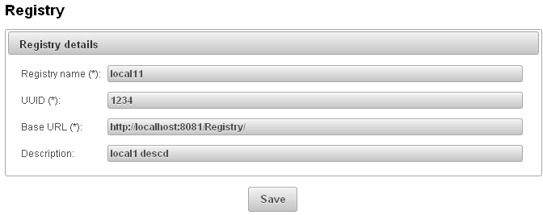
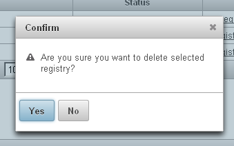
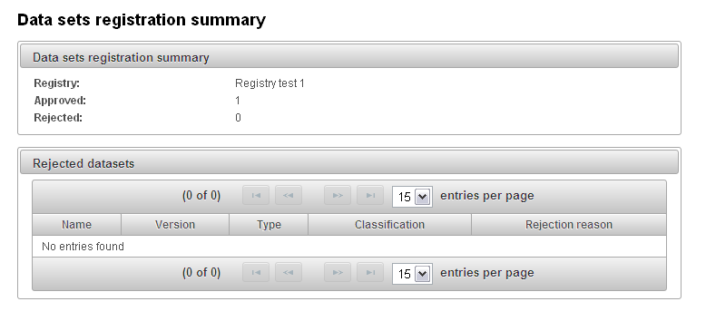
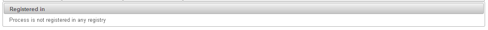

#soda4LCA Node User Guide

#Introduction

ILCD Node is the part of ILCD system. The application provides the Node
users the possibility of importing and management of dataset within a
node, sharing the data in the network and searching for data provided by
other nodes.

#Purpose

The goal of this document is to deliver the user clear description about
functionalities of ILCD Node. The document provides general information
about the way of working, accessing and navigating within the
application.

Scope
-----

This user guide contains only description of functionalities regarding
node/dataset lifecycle in the network (registration, deregistration,
search)

The reader will not find in this document information about
functionalities of first version of Node (soda4LCA) application
(importing, management and review of dataset)

Requirements
------------

1.  Web browser with CSS 2.0 and JavaScript enabled.

##Functionalities of ILCD Node 

The scope of functionalities described in this document:

-   Nodes registration

-   Node deregistration

-   Adding new registry

-   Registry details review

-   Editing registry

-   Removing registry

-   Datasets registration

-   Datasets deregistration

-   Dataset registration details review

-   Removing datasets

-   Synchronizes nodes and datasets

-   Search in a network

##General Functionalities

Before describing in detail the functionalities provided to the user, it
is necessary to introduce the general interface behaviour of the
application.

### Confirmation windows

Some of the action on Node must be confirm by the user to process
operation.

Example:

### Sever side error

If any error occurs or selected action can not be performed system
displays a dialog with an appropriate warning message.

Example:

### Email Notification

To improve the workflow, the Node user is to be automatically notified
for any action (acceptance, rejection, deregistration) regarding its
request.

Login
-----

This functionality is required to get access administrative area.

Once the user starts login page, system prompt the user to enter **User
name** and **Password** – both fields are required and case-sensitive.
The user invokes the user authentication process by clicking the
**Login** button.

When the authentication is successful, the user is allowed to start to
perform actions on administrative part of ILCD Node.

In case of any problems during the login action appropriate message will
be shown:

1.  **Incorrect authentication** – login and/or password is incorrect.
    The user should enter valid credentials and try again to login.

Logout
------

There are two ways of log out:

1.  The Registry admin can log out itself using the logout button from
    the menu at the bottom of the page.

  

2.  The Registry admin is logged out by the system because of inactivity
    (**after 30 minutes**).

Adding new registry
-------------------

In order to utilize network capabilities of the application, node needs
to be registered in one of existing registries. Before the registration
process can start, registry has to be added to the application. Only
users with administrator privileges are allowed to perform this
operation.

In order to add new registry:

1.  Navigate to Network -&gt; Registries

2.  Press *Add registry* button

  

1.  Following form will be displayed

 

1.  Fill in all mandatory fields and press save

> All values that have to be inserted will be published. **It is
> important to insert the exact values, especially value of UUID and
> Base URL. In case network wide doesn’t work as expected please check
> the value of UUID.**

Registry details
----------------

User with appropriate privileges has to possibility to consult details
of a registry.

1.  Select Registries from Network menu

 

1.  Click on selected Registry name and consult Registry details.

  

1.  When a node is the part of the network Registry details and list of
    nodes in the network will be displayed. In other case only Registry
    details will be shown.

 

Edit registry details
---------------------

User with appropriate privileges has to possibility to edit details of a
registry.

1.  Navigate to Network -&gt; Registries

2.  Click *Edit registry* link in *Action* column of selected registry

 

1.  You will be redirected to Registry details page

 

1.  Insert new values and press Save

Remove registry
---------------

User with appropriate privileges has to possibility to remove registry.
Registries on which node is registered cannot be removed. Node has to be
deregistered first.

1.  Navigate to Network -&gt; Registries

2.  Click *Edit registry* link in *Action* column of selected registry

 

1.  System will ask for confirmation

 

1.  Confirm the choice

2.  Confirmation message will be displayed

 

Node registration 
------------------

To send node registration request execute the following steps

1.  Please select Registries from Network menu

 

1.  Select Registry and from Action column click on Register –
    Registration page appears

 

1.  Complete Access Account and Access Password fields (These fields are
    not your credentials on Node application). These fields will be used
    to authenticate deregistration action. Node ID and Base URL are
    entered by default by the system, but it is possible to change
    the values. Please pay attention on URL – in case of incorrect value
    the registration will be not processed.

 

1.  After successfully sending node registration request the status of
    this node on registry is Pending registration.

 

1.  When the Registry admin approves your request the status will be
    changed do Registered. You will be also informed about approval
    by email.

 

NOTE!

Node can be registered in many networks.

 

Node deregistration 
--------------------

In order to deregister node follow the steps:

1.  Navigate to Registries page

2.  Find the registry you want to deregister from and click Deregister
    link in Action column

 

1.  You will be redirected to the authorization page. Enter user and
    password which were selected during registration and click
    Deregister

 

1.  After pressing the button, you will be asked for confirmation. Click
    Yes

 

> System will prevent you from deregistration if there are any
> registered datasets. You will be asked to deregister datasets first.

 

> If you entered user and/or password are incorrect, appropriate message
> will be displayed:
>
 

Synchronizes nodes
------------------

 

 
 
 UUID
-------
###General
The automatically generated UUID (Universally Unique Identifier) is the unique id of a data set (different versions of a dataset have same UUID). Together with the version of a data set, it does uniquely identify each data set. 

####Show UUID of a Data Set
There are several ways to show the UUID of a data set. The easiest way is to hover over the name of the data set. 
Then the UUID of the data set is shown followed by the version of the data set.

Another easy way is to look at the "Name" column of a data set. In this column, the UUID is printed below the name of the corresponding data set.

####Filter By UUID
To search for a certain UUID, one has to type in the string "uuid:" followed by a 
substring of the wanted uuid in the filter text field of the name column.
Then all data sets containing the written substring are shown.

Here is an example how you can filter by a certain UUID:

Dataset registration 
---------------------

Each dataset exists on a node can be registered on the selected registry
what means that this dataset is visible (searchable) by other nodes in
the network.

To share a dataset on the network perform the following steps:

1.  Go to Manage Data Sets and select Manage Processes

 

1.  Select datasets you want to register and use Register selected
    button

 

1.  Registration datasets page appears. Please select the
    network (Registry) where you want to send registration request (
    Registry list contains only registries in which node is registered)
    and next use Register button – Data sets registration
    summary appears.

 

1.  On Data sets registration summary you can consult how many data sets
    have been approved and rejected (because of validation rules)
    by registry.

> 
>
> In case of rejection data sets for each rejection reason is depicted.
> Possible reasons:

-   Compliance systems are not valid

-   Sent data set is already registered on selected registry (exactly
    the same data set – all data has to match)

> 

Dataset registration details 
-----------------------------

In order to view dataset registration details:

1.  Navigate to *Manage Processes* page

 

1.  Select dataset from datasets list

 

1.  At the bottom of the page there will be table with list of
    registries in which selected dataset is registered in.

 

Dataset deregistration 
-----------------------

In order to deregister single dataset from registry:

1.  Navigate to dataset details page (see 2.8)

2.  Click *Deregister process* link from *Action* column of *Registered
    in* table

 

1.  You will be asked to enter reason of deregistration

 

1.  Enter the reason and confirm

 

Alternatively, batch deregistration can be performed.

1.  Navigate to *Manage Processes* page

2.  From *Registered in* (1) menu, select the registry you want to
    deregister from

 

1.  Use checkboxes (2) to select the datasets you want to deregister

2.  Press *Deregister selected* button to deregister datasets

3.  You will be asked to enter reason of deregistration

 

1.  Enter the reason and confirm

##Removing datasets

User with appropriate privileges has to possibility to remove datasets.

1.  Navigate to *Manage Processes* page

2.  Select datasets you want to remove

3.  Press *Delete Selected* button

4.  Confirmation dialog will be displayed

In case any of selected datasets is registered on any registry, the
dialog will contain additional table with datasets that are registered.
System will automatically send deregistration request for those
datasets.

 

1.  Confirm your choice

##Search in the network

Network-wide search is implemented as extension to regular search
functionality. In order to perform network-wide search:

1.  Navigate to the Search Process page

2.  Check *Search across network* checkbox

 

1.  After checking the checkbox, additional panel will be displayed

 

1.  Since node can be registered in many registries, the registry to
    search in has to be chosen from *Select registry to search* menu

2.  After pressing the *Search* button, user is redirected to the
    result page. Optionally there might be displayed additional table,
    that contains names of nodes which did not respond for searching
    request

> 
